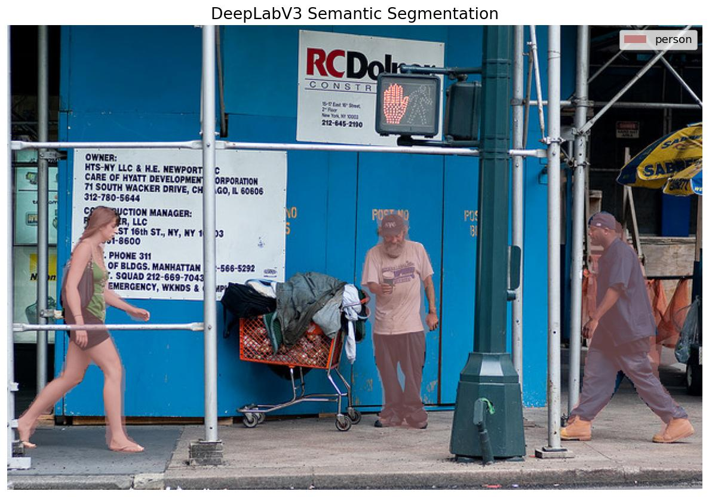

# DeepLabV3

**Paper**: [Rethinking Atrous Convolution for Semantic Image Segmentation](https://arxiv.org/abs/1706.05587)

DeepLabV3 is a highly accurate semantic segmentation model that employs atrous (dilated) convolution to capture multi-scale spatial context without losing spatial resolution. It features an Atrous Spatial Pyramid Pooling (ASPP) module that probes convolutional features at multiple scales, making it highly robust for segmenting objects of varying sizes.

## Architecture Highlights

- **ResNet Backbone:** Leverages deep residual networks (ResNet-50 or ResNet-101) for robust feature extraction.
- **Atrous Convolution:** Controls the resolution of features computed by Deep CNNs and effectively enlarges the field of view of filters without increasing the number of parameters or the amount of computation.
- **ASPP Module:** Captures multi-scale information by applying parallel atrous convolutions with different dilation rates.

## Available Models

| Model | Description | Weights |
|-------|-------------|---------|
| `DeepLabV3ResNet50` | DeepLabV3 with a ResNet-50 backbone | `coco_voc` |
| `DeepLabV3ResNet101` | DeepLabV3 with a ResNet-101 backbone | `coco_voc` |

*Note: The `coco_voc` weights are pre-trained on the COCO dataset and fine-tuned on the PASCAL VOC segmentation dataset. They output predictions across 21 classes (20 objects + 1 background).*

## Basic Usage

```python
import kmodels

# Load model with pre-trained weights
model = kmodels.models.deeplabv3.DeepLabV3ResNet50(weights="coco_voc", input_shape=(512, 512, 3))

# Using ResNet101 backbone
model_large = kmodels.models.deeplabv3.DeepLabV3ResNet101(weights="coco_voc", input_shape=(512, 512, 3))

# Initialize a model without pre-trained weights for custom training
custom_model = kmodels.models.deeplabv3.DeepLabV3ResNet50(
    weights=None,
    input_shape=(512, 512, 3),
    num_classes=21
)
```

## Inference Example

```python
import keras
import numpy as np
from PIL import Image
import kmodels

model = kmodels.models.deeplabv3.DeepLabV3ResNet50(weights="coco_voc", input_shape=(512, 512, 3))

image = Image.open("image.jpg").convert("RGB")
original_size = image.size
resized = image.resize((512, 512))

input_tensor = keras.ops.convert_to_tensor(np.array(resized).astype("float32") / 255.0)
input_tensor = keras.ops.expand_dims(input_tensor, axis=0)  # Shape: (1, 512, 512, 3)

output = model(input_tensor, training=False)  # Output shape: (1, 512, 512, 21)
pred_mask = keras.ops.convert_to_numpy(keras.ops.argmax(output, axis=-1)[0])

VOC_CLASSES = ["background", "aeroplane", "bicycle", "bird", "boat", "bottle",
    "bus", "car", "cat", "chair", "cow", "dining table", "dog", "horse",
    "motorbike", "person", "potted plant", "sheep", "sofa", "train", "tv/monitor"]

classes = np.unique(pred_mask)
print(f"Detected: {[VOC_CLASSES[c] for c in classes if c > 0]}")

# Output:
# Detected: ['person']
```

## Full Inference with Visualization

```python
import os
os.environ["KERAS_BACKEND"] = "torch"

import numpy as np
import keras
from PIL import Image
import matplotlib
matplotlib.use("Agg")
import matplotlib.pyplot as plt

from kmodels.models.deeplabv3 import DeepLabV3ResNet50

VOC_CLASSES = ["background", "aeroplane", "bicycle", "bird", "boat", "bottle",
    "bus", "car", "cat", "chair", "cow", "dining table", "dog", "horse",
    "motorbike", "person", "potted plant", "sheep", "sofa", "train", "tv/monitor"]

VOC_COLORMAP = np.array([
    [0, 0, 0], [128, 0, 0], [0, 128, 0], [128, 128, 0], [0, 0, 128],
    [128, 0, 128], [0, 128, 128], [128, 128, 128], [64, 0, 0], [192, 0, 0],
    [64, 128, 0], [192, 128, 0], [64, 0, 128], [192, 0, 128], [64, 128, 128],
    [192, 128, 128], [0, 64, 0], [128, 64, 0], [0, 192, 0], [128, 192, 0],
    [0, 64, 128],
], dtype=np.uint8)

model = DeepLabV3ResNet50(weights="coco_voc", input_shape=(512, 512, 3))

img = Image.open("image.jpg").convert("RGB")
original_size = img.size  # (W, H)
resized = img.resize((512, 512))

input_tensor = keras.ops.convert_to_tensor(np.array(resized).astype("float32") / 255.0)
input_tensor = keras.ops.expand_dims(input_tensor, axis=0)

output = model(input_tensor, training=False)
pred_mask = keras.ops.convert_to_numpy(keras.ops.argmax(output, axis=-1)[0])

# Resize mask to original size
mask_resized = np.array(
    Image.fromarray(pred_mask.astype(np.uint8)).resize(original_size, Image.NEAREST)
)

colored_mask = VOC_COLORMAP[mask_resized]
overlay = np.array(img).copy()
alpha = 0.5
mask_pixels = mask_resized > 0
overlay[mask_pixels] = (overlay[mask_pixels] * (1 - alpha) + colored_mask[mask_pixels] * alpha).astype(np.uint8)

fig, ax = plt.subplots(1, 1, figsize=(10, 7))
ax.imshow(overlay)

# Add legend
unique_classes = [c for c in np.unique(mask_resized) if c > 0]
legend_patches = [plt.Rectangle((0, 0), 1, 1, fc=VOC_COLORMAP[c] / 255.0) for c in unique_classes]
if legend_patches:
    ax.legend(legend_patches, [VOC_CLASSES[c] for c in unique_classes], loc="upper right", fontsize=11)

ax.set_title("DeepLabV3 Semantic Segmentation", fontsize=16)
ax.axis("off")
plt.tight_layout()
fig.savefig("deeplabv3_output.jpg", bbox_inches="tight", dpi=120)
plt.close(fig)
```


