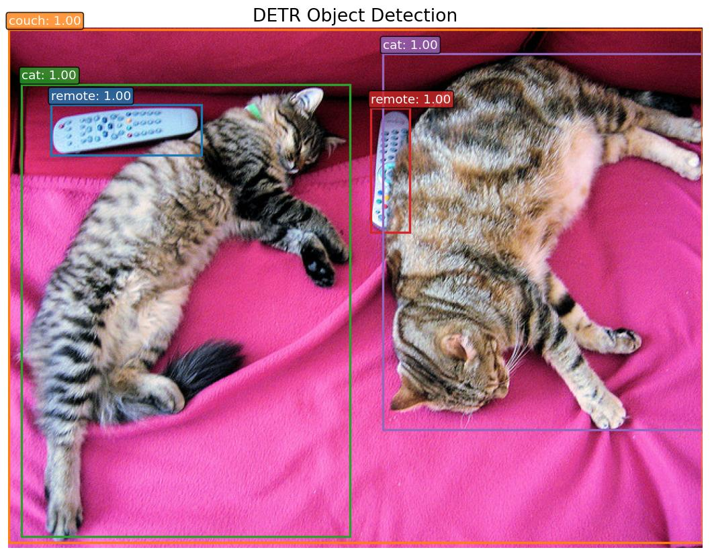

# DETR

**Paper**: [End-to-End Object Detection with Transformers](https://arxiv.org/abs/2005.12872)

DETR (DEtection TRansformer) is an end-to-end object detection model that combines a convolutional backbone with a Transformer encoder-decoder architecture. It eliminates the need for hand-designed components like non-maximum suppression and anchor generation by using a set-based global loss via bipartite matching.

## Architecture Highlights

- **Bipartite Matching Loss:** Frames object detection as a direct set prediction problem utilizing Hungarian matching for optimal assignments.
- **Transformers Encoder-Decoder:** Replaces standard CNN detection heads with a robust transformer architecture, preserving global image context and relationships between objects in the scene.
- **ResNet Backbones:** Uses standard deep residual networks (ResNet-50/ResNet-101) to extract initial 2D feature representations.
- **Simplified Pipeline:** Streamlines standard complex detection pipelines into a straightforward encode-decode translation framework.

## Available Models

| Model | Description | Weights |
|-------|-------------|---------|
| `DETRResNet50` | DETR with a ResNet-50 backbone | `detr_resnet50_coco.weights.h5` |
| `DETRResNet101` | DETR with a ResNet-101 backbone | `detr_resnet_101_coco.weights.h5` |

*Note: The `detr_resnet50_coco` weights are pre-trained on the COCO 2017 object detection dataset.*

## Basic Usage

```python
import kmodels

# Load DETR with ResNet-50 backbone (COCO pre-trained)
model = kmodels.models.detr.DETRResNet50(
    weights="detr_resnet50_coco.weights.h5",
    input_shape=(800, 800, 3),
    include_normalization=False,
)

# Without pre-trained weights
model = kmodels.models.detr.DETRResNet50(weights=None, input_shape=(800, 800, 3))

# ResNet-101 variant
model = kmodels.models.detr.DETRResNet101(weights=None, input_shape=(800, 800, 3))
```

## Example Inference

```python
import kmodels
from kmodels.models.detr import DETRImageProcessor, DETRPostProcessor
from PIL import Image

model = kmodels.models.detr.DETRResNet50(
    weights="coco",
    input_shape=(800, 800, 3),
    include_normalization=False,
)

image = Image.open("image.jpg")
original_size = image.size[::-1]  # (H, W)

# Preprocess: resize, rescale, ImageNet normalize
processed = DETRImageProcessor(size={"height": 800, "width": 800})(image)

# Inference
output = model(processed, training=False)
# output["logits"]:     (1, 100, 92) — class logits per query
# output["pred_boxes"]: (1, 100, 4)  — normalized (cx, cy, w, h)

# Post-process: filter by confidence, convert boxes to pixel coords
results = DETRPostProcessor(output, threshold=0.7, target_sizes=[original_size])
for score, label, box in zip(results[0]["scores"], results[0]["label_names"], results[0]["boxes"]):
    print(f"{label}: {score:.2f} at [{box[0]:.0f}, {box[1]:.0f}, {box[2]:.0f}, {box[3]:.0f}]")

# Output:
# remote: 1.00 at [39, 71, 178, 117]
# couch: 1.00 at [0, 1, 640, 474]
# cat: 1.00 at [12, 52, 315, 469]
# remote: 1.00 at [334, 74, 370, 188]
# cat: 1.00 at [345, 24, 640, 371]
```

### Data format

Every processor and format-sensitive post-processor in this module accepts a `data_format=None` kwarg. The default (`None`) resolves to `keras.config.image_data_format()`; pass `"channels_first"` or `"channels_last"` to override per-call without touching global state.

```python
# follow the global config (the default)
inputs = DETRImageProcessor()("photo.jpg")

# force channels_first for this call only
inputs = DETRImageProcessor(data_format="channels_first")("photo.jpg")
```

Image processors return tensors in the requested layout; post-processors accept tensors in either layout and read the flag to pick the channel axis. See `docs/utils.md` for which families have format-sensitive post-processors.

## Full Inference with Visualization

```python
import os
os.environ["KERAS_BACKEND"] = "torch"

import numpy as np
from PIL import Image
import matplotlib
matplotlib.use("Agg")
import matplotlib.pyplot as plt

from kmodels.models.detr import DETRResNet50, DETRImageProcessor, DETRPostProcessor

model = DETRResNet50(weights="coco", input_shape=(800, 800, 3), include_normalization=False)

img = Image.open("image.jpg").convert("RGB")
original_size = img.size[::-1]  # (H, W)

processed = DETRImageProcessor(size={"height": 800, "width": 800})(img)
output = model(processed, training=False)

results = DETRPostProcessor(output, threshold=0.7, target_sizes=[original_size])

COLORS = plt.cm.tab10.colors

fig, ax = plt.subplots(1, 1, figsize=(10, 7))
ax.imshow(np.array(img))

for i, (score, label, box) in enumerate(zip(results[0]["scores"], results[0]["label_names"], results[0]["boxes"])):
    color = COLORS[i % len(COLORS)]
    x1, y1, x2, y2 = box
    rect = plt.Rectangle((x1, y1), x2 - x1, y2 - y1, linewidth=2, edgecolor=color, facecolor="none")
    ax.add_patch(rect)
    ax.text(x1, y1 - 5, f"{label}: {score:.2f}", fontsize=11, color="white",
            bbox=dict(boxstyle="round,pad=0.2", facecolor=color, alpha=0.8))

ax.set_title("DETR Object Detection", fontsize=16)
ax.axis("off")
plt.tight_layout()
fig.savefig("detr_output.jpg", bbox_inches="tight", dpi=120)
plt.close(fig)
```



## Custom Dataset Usage

When using a model fine-tuned on a custom dataset, pass your class names to the post-processor via `label_names`:

```python
MY_CLASSES = ["cat", "dog", "bird"]

results = DETRPostProcessor(output, threshold=0.7,
    target_sizes=[original_size], label_names=MY_CLASSES)
```

If `label_names` is not provided, COCO class names are used by default.
