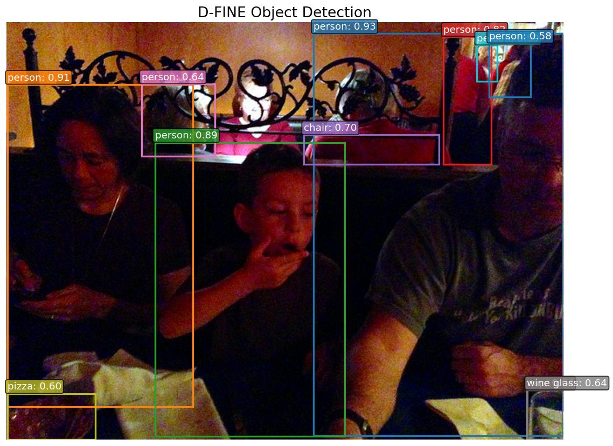

# D-FINE

**Paper**: [D-FINE: Redefine Regression Task of DETRs as Fine-grained Distribution Refinement](https://arxiv.org/abs/2410.13842)

D-FINE is a real-time object detection model that redefines the bounding box regression task in DETR-based detectors as Fine-grained Distribution Refinement (FDR). Instead of directly predicting box coordinates, it models the box regression as a probability distribution over discrete bins, enabling iterative refinement across decoder layers. Combined with Localization Quality Estimation (LQE), D-FINE achieves state-of-the-art accuracy among real-time detectors.

## Architecture Highlights

- **HGNetV2 Backbone:** A high-performance CNN backbone with optional Learnable Affine Block (LAB) for adaptive feature calibration.
- **Hybrid Encoder (AIFI + CCFM):** Attention-based Intra-scale Feature Interaction followed by Cross-scale Channel Feature Merge with FPN top-down and PAN bottom-up paths using RepNCSPELAN4 blocks.
- **Fine-grained Distribution Refinement (FDR):** Each decoder layer predicts a distribution over bins rather than raw coordinates, with distributions accumulated across layers for progressive refinement.
- **Localization Quality Estimation (LQE):** Refines classification scores using the confidence of the predicted bounding box distribution, improving detection reliability.
- **Deformable Cross-Attention:** Multi-scale deformable attention with variable sampling points per feature level for efficient encoder-decoder interaction.

## Available Models

| Model | Backbone | Params | Weights |
|-------|----------|--------|---------|
| `DFineNano` | HGNetV2-Nano | 6M | `coco` |
| `DFineSmall` | HGNetV2-Small | 11M | `coco` |
| `DFineMedium` | HGNetV2-Medium | 20M | `coco` |
| `DFineLarge` | HGNetV2-Large | 32M | `coco` |
| `DFineXLarge` | HGNetV2-XLarge | 63M | `coco` |

## Basic Usage

```python
import kmodels

# D-FINE Large (COCO pre-trained)
model = kmodels.models.dfine.DFineLarge(weights="coco")

# Available variants
model = kmodels.models.dfine.DFineNano(weights="coco")
model = kmodels.models.dfine.DFineSmall(weights="coco")
model = kmodels.models.dfine.DFineMedium(weights="coco")
model = kmodels.models.dfine.DFineXLarge(weights="coco")

# Without pre-trained weights
model = kmodels.models.dfine.DFineLarge(weights=None, input_shape=(640, 640, 3))
```

## Example Inference

```python
import kmodels
from kmodels.models.dfine import DFineImageProcessor
from PIL import Image

model = kmodels.models.dfine.DFineLarge(weights="coco")

image = Image.open("image.jpg")
original_size = image.size[::-1]  # (H, W)

# Preprocess: resize to 640x640, rescale to [0, 1] (no ImageNet normalization)
processor = DFineImageProcessor()
inputs = processor(image)

# Inference
output = model(inputs["pixel_values"], training=False)
# output["logits"]:     (1, 300, 80) — class logits per query
# output["pred_boxes"]: (1, 300, 4)  — normalized (cx, cy, w, h)

# Post-process: sigmoid, top-K selection, convert boxes to pixel coords
results = processor.post_process_object_detection(output, threshold=0.5, target_sizes=[original_size])
for score, label, box in zip(results[0]["scores"], results[0]["label_names"], results[0]["boxes"]):
    print(f"{label}: {score:.2f} at [{box[0]:.0f}, {box[1]:.0f}, {box[2]:.0f}, {box[3]:.0f}]")

# Output:
# person: 0.93 at [352, 13, 640, 475]
# person: 0.91 at [1, 71, 214, 442]
# person: 0.89 at [170, 138, 389, 476]
# person: 0.82 at [502, 16, 557, 163]
# chair: 0.70 at [341, 129, 497, 163]
# cup: 0.64 at [598, 423, 640, 480]
```

### Data format

The image processor accepts a `data_format=None` kwarg. The default (`None`) resolves to `keras.config.image_data_format()`; pass `"channels_first"` or `"channels_last"` to override per-call without touching global state.

```python
# follow the global config (the default)
processor = DFineImageProcessor()
inputs = processor("photo.jpg")

# force channels_first for this call only
processor = DFineImageProcessor(data_format="channels_first")
inputs = processor("photo.jpg")
```

Detection post-processors emit boxes in `xyxy` pixel coordinates and class indices — there is no spatial channel axis to interpret, so they don't take a `data_format` kwarg. See `docs/utils.md` for the families that do.

## Full Inference with Visualization

```python
import os
os.environ["KERAS_BACKEND"] = "torch"

import numpy as np
from PIL import Image
import matplotlib
matplotlib.use("Agg")
import matplotlib.pyplot as plt

from kmodels.models.dfine import DFineLarge, DFineImageProcessor

model = DFineLarge(weights="coco")

img = Image.open("image.jpg").convert("RGB")
original_size = img.size[::-1]  # (H, W)

processor = DFineImageProcessor()
inputs = processor(img)
output = model(inputs["pixel_values"], training=False)

results = processor.post_process_object_detection(output, threshold=0.5, target_sizes=[original_size])

COLORS = plt.cm.tab10.colors

fig, ax = plt.subplots(1, 1, figsize=(10, 7))
ax.imshow(np.array(img))

for i, (score, label, box) in enumerate(zip(results[0]["scores"], results[0]["label_names"], results[0]["boxes"])):
    color = COLORS[i % len(COLORS)]
    x1, y1, x2, y2 = [float(x) for x in box]
    rect = plt.Rectangle((x1, y1), x2 - x1, y2 - y1, linewidth=2, edgecolor=color, facecolor="none")
    ax.add_patch(rect)
    ax.text(x1, y1 - 5, f"{label}: {float(score):.2f}", fontsize=11, color="white",
            bbox=dict(boxstyle="round,pad=0.2", facecolor=color, alpha=0.8))

ax.set_title("D-FINE Object Detection", fontsize=16)
ax.axis("off")
plt.tight_layout()
fig.savefig("dfine_output.jpg", bbox_inches="tight", dpi=120)
plt.close(fig)
```



## Custom Dataset Usage

When using a model fine-tuned on a custom dataset, pass your class names to the post-processor via `label_names`:

```python
MY_CLASSES = ["cat", "dog", "bird"]

results = processor.post_process_object_detection(output, threshold=0.5,
    target_sizes=[original_size], label_names=MY_CLASSES)
```

If `label_names` is not provided, COCO class names are used by default.

## Preprocessing Notes

Like RT-DETR, D-FINE does **not** apply ImageNet normalization. The model expects input images rescaled to `[0, 1]` (divide by 255) and resized to `640x640`. The `DFineImageProcessor` handles this automatically.

## Weight Conversion

To convert weights from HuggingFace checkpoints:

```bash
KERAS_BACKEND=torch python kmodels/models/dfine/convert_dfine_hf_to_keras.py
```

This converts all 5 checkpoints from the [ustc-community](https://huggingface.co/ustc-community) organization:
- `ustc-community/dfine-nano-coco`
- `ustc-community/dfine-small-coco`
- `ustc-community/dfine-medium-coco`
- `ustc-community/dfine-large-coco`
- `ustc-community/dfine-xlarge-coco`
