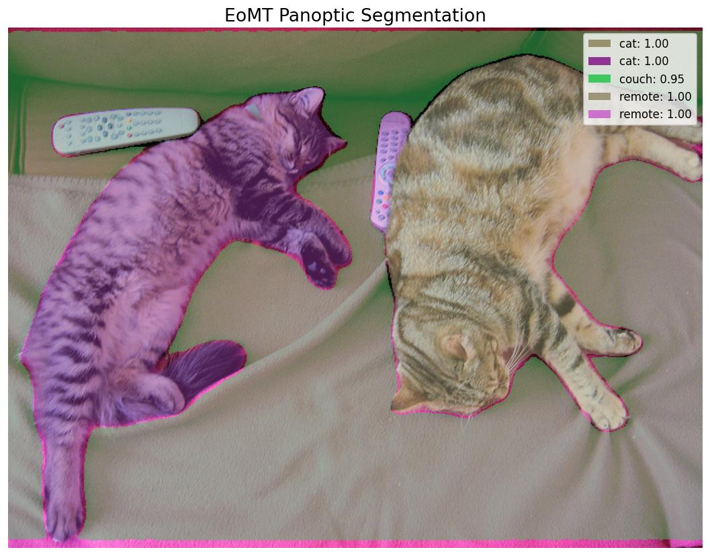

# EoMT

**Paper**: [Your ViT is Secretly an Image Segmentation Model](https://arxiv.org/abs/2503.19108)

EoMT (Encoder-only Mask Transformer) is a panoptic segmentation model that simplifies the standard encoder-decoder mask transformer pipeline by using only an encoder architecture. This approach reduces complexity while maintaining competitive segmentation performance.

## Architecture Highlights

- **Encoder-Only Design:** Simplifies the standard encode-decode vision pipeline by utilizing an highly efficient encoder-only design for panoptic segmentation.
- **Unified Segmentation Modeling:** Simultaneously excels at semantic, instance, and panoptic segmentation under one streamlined framework.
- **High Efficiency:** Eliminates the heavyweight decoder yielding drastically improved computational overhead and low latency.
- **Top-Tier Panoptic Processing:** Delivers strong dense prediction accuracy across varied visual domains and complex overlapping imagery.

## Available Models

| Model Variant | Supported Pre-trained Weights | Description |
|---------------|-------------------------------|-------------|
| `EoMTSmall`  | `coco_panoptic_640`           | Lightweight variant for panoptic segmentation |
| `EoMTBase`   | `coco_panoptic_640`           | Standard base variant for panoptic segmentation |
| `EoMTLarge`  | `coco_panoptic_640`, `coco_instance_640`, `ade20k_semantic_512` | Large variant supporting Panoptic, Instance, and Semantic segmentation |

*Note: `coco_panoptic_640` weights are pretrained on the COCO panoptic dataset at 640x640 resolution. `coco_instance_640` brings COCO instance segmentation capability. `ade20k_semantic_512` provides rigorous semantic segmentation trained on the ADE20K dataset natively working at 512x512 resolution.*

## Basic Usage

```python
import kmodels

# Small Variant
model = kmodels.models.eomt.EoMTSmall(weights="coco_panoptic_640", input_shape=(640, 640, 3))

# Large Variant with Instance Weights
model_large = kmodels.models.eomt.EoMTLarge(weights="coco_instance_640", input_shape=(640, 640, 3))

# Without pre-trained weights
model_custom = kmodels.models.eomt.EoMTBase(weights=None, input_shape=(640, 640, 3))
```

## Inference Example

```python
import kmodels
from kmodels.models.eomt import EoMTImageProcessor
from PIL import Image

model = kmodels.models.eomt.EoMTLarge(weights="coco_panoptic_640", input_shape=(640, 640, 3))

image = Image.open("image.jpg").convert("RGB")
original_h, original_w = image.size[1], image.size[0]

# Preprocess: resize, pad to square, rescale, ImageNet normalize
processor = EoMTImageProcessor(target_size=640)
inputs = processor(image)

# Inference
output = model(inputs["pixel_values"], training=False)
# output["class_logits"]: (1, num_queries, 134) — class logits per query
# output["mask_logits"]:  (1, num_queries, mask_h, mask_w) — mask logits

#   processor.post_process_panoptic_segmentation(...)
#   processor.post_process_semantic_segmentation(...)
#   processor.post_process_instance_segmentation(...)
result = processor.post_process_panoptic_segmentation(
    output, target_size=(original_h, original_w), threshold=0.8,
)
for seg in result["segments_info"][:6]:
    name = seg["label_name"].replace("things: ", "").replace("stuff: ", "")
    print(f"{name}: {seg['score']:.2f}")

# Output:
# cat: 1.00
# cat: 1.00
# couch: 0.95
# remote: 1.00
# remote: 1.00
```

## Segmentation Modes

`EoMTImageProcessor` exposes the three post-processing modes as methods,
mirroring HuggingFace `transformers`:

```python
processor = EoMTImageProcessor(target_size=640)
output = model(processor(image), training=False)
target_size = (image.height, image.width)

# Panoptic (things + stuff merged into one segmentation)
panoptic = processor.post_process_panoptic_segmentation(
    output, target_size=target_size, threshold=0.8,
)

# Semantic (per-pixel class id, no instance separation)
semantic = processor.post_process_semantic_segmentation(
    output, target_size=target_size,
)

# Instance (per-object binary masks)
instance = processor.post_process_instance_segmentation(
    output, target_size=target_size, threshold=0.5,
)
```

| Method | Returns |
|---|---|
| `post_process_panoptic_segmentation` | `{"segmentation": (H, W) int32, "segments_info": [...]}` |
| `post_process_semantic_segmentation` | `{"segmentation": (H, W) int32, "class_names": [...]}` |
| `post_process_instance_segmentation` | `{"segmentation": (H, W) int32, "segments_info": [...]}` |

The same forward pass on `model` is shared across all three methods —
just call the one(s) you need.

### Data format

Every processor and format-sensitive post-processor in this module accepts a `data_format=None` kwarg. The default (`None`) resolves to `keras.config.image_data_format()`; pass `"channels_first"` or `"channels_last"` to override per-call without touching global state.

```python
# follow the global config (the default)
processor = EoMTImageProcessor()
inputs = processor("photo.jpg")

# force channels_first for this call only
processor = EoMTImageProcessor(data_format="channels_first")
inputs = processor("photo.jpg")
```

Image processors return tensors in the requested layout; post-processors accept tensors in either layout and read the flag to pick the channel axis. See `docs/utils.md` for which families have format-sensitive post-processors.

## Full Inference with Visualization

```python
import os
os.environ["KERAS_BACKEND"] = "torch"

import numpy as np
from PIL import Image
import matplotlib
matplotlib.use("Agg")
import matplotlib.pyplot as plt

from kmodels.models.eomt import EoMTLarge, EoMTImageProcessor

model = EoMTLarge(weights="coco_panoptic_640", input_shape=(640, 640, 3))

img = Image.open("image.jpg").convert("RGB")
original_h, original_w = img.size[1], img.size[0]

processor = EoMTImageProcessor(target_size=640)
inputs = processor(img)
output = model(inputs["pixel_values"], training=False)

result = processor.post_process_panoptic_segmentation(
    output, target_size=(original_h, original_w), threshold=0.8,
)

segmentation = result["segmentation"]
segments_info = result["segments_info"]

np.random.seed(42)
colors = np.random.randint(50, 220, size=(len(segments_info) + 1, 3), dtype=np.uint8)

colored = np.zeros((original_h, original_w, 3), dtype=np.uint8)
for seg in segments_info:
    mask = segmentation == seg["id"]
    colored[mask] = colors[seg["id"]]

overlay = np.array(img).copy()
alpha = 0.5
has_seg = segmentation >= 0
overlay[has_seg] = (overlay[has_seg] * (1 - alpha) + colored[has_seg] * alpha).astype(np.uint8)

fig, ax = plt.subplots(1, 1, figsize=(10, 7))
ax.imshow(overlay)

legend_patches = []
legend_names = []
for seg in segments_info[:10]:
    color = colors[seg["id"]] / 255.0
    patch = plt.Rectangle((0, 0), 1, 1, fc=color)
    legend_patches.append(patch)
    name = seg["label_name"].replace("things: ", "").replace("stuff: ", "")
    legend_names.append(f"{name}: {seg['score']:.2f}")
if legend_patches:
    ax.legend(legend_patches, legend_names, loc="upper right", fontsize=10)

ax.set_title("EoMT Panoptic Segmentation", fontsize=16)
ax.axis("off")
plt.tight_layout()
fig.savefig("eomt_output.jpg", bbox_inches="tight", dpi=120)
plt.close(fig)
```


