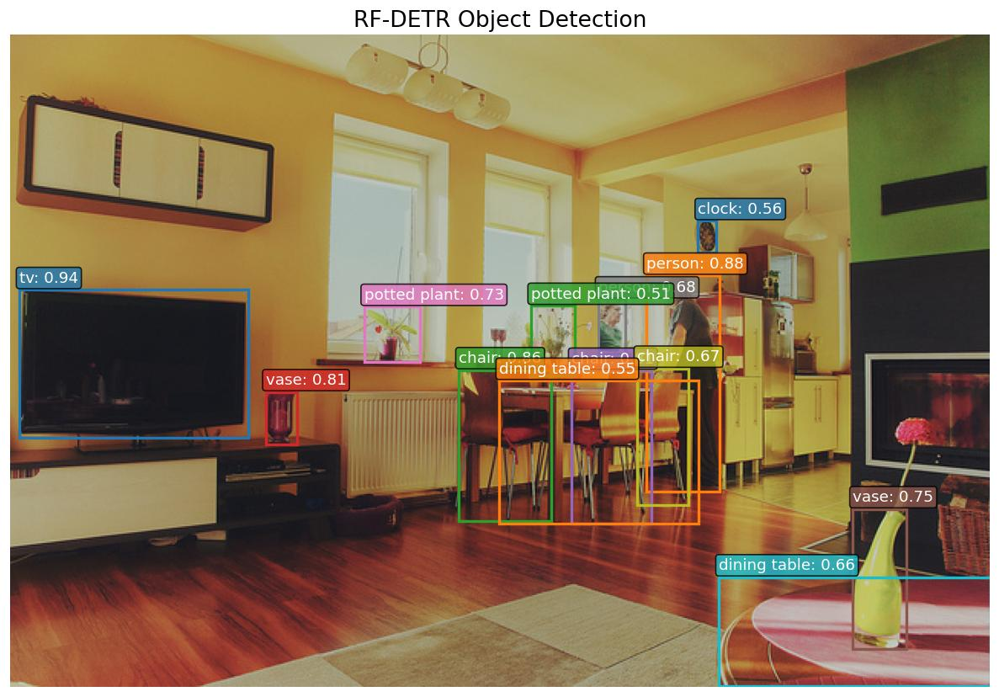

# RF-DETR

**Paper**: [RF-DETR: Neural Architecture Search for Real-Time Detection Transformers](https://arxiv.org/abs/2511.09554)

RF-DETR is a real-time object detection model based on the DETR framework, using neural architecture search to find efficient configurations and a DINOv2 backbone. It comes in multiple size variants to balance speed and accuracy for different deployment scenarios.

## Model Variants

- **RFDETRNano** — 384px resolution
- **RFDETRSmall** — 512px resolution
- **RFDETRMedium** — 576px resolution
- **RFDETRBase** — 560px resolution, 29M params
- **RFDETRLarge** — 704px resolution

## Basic Usage

```python
import kmodels

# RF-DETR Base (29M params, 560px, COCO pre-trained)
model = kmodels.models.rf_detr.RFDETRBase(weights="coco")

# Available variants
model = kmodels.models.rf_detr.RFDETRNano(weights="coco")
model = kmodels.models.rf_detr.RFDETRSmall(weights="coco")
model = kmodels.models.rf_detr.RFDETRMedium(weights="coco")
model = kmodels.models.rf_detr.RFDETRLarge(weights="coco")

# Without pre-trained weights
model = kmodels.models.rf_detr.RFDETRBase(weights=None)
```

## Example Inference

```python
import kmodels
from kmodels.models.rf_detr import RFDETRImageProcessor
from PIL import Image

model = kmodels.models.rf_detr.RFDETRBase(weights="coco")

image = Image.open("image.jpg")
original_size = image.size[::-1]  # (H, W)

# Preprocess: rescale, ImageNet normalize, resize to model resolution
processor = RFDETRImageProcessor(size={"height": 560, "width": 560})
processed = processor(image)

# Inference
output = model(processed, training=False)
# output["pred_logits"]: (1, 300, 91) — class logits per query
# output["pred_boxes"]:  (1, 300, 4)  — normalized (cx, cy, w, h)

# Post-process: sigmoid, top-K selection, convert boxes to pixel coords
results = processor.post_process_object_detection(output, threshold=0.5, target_sizes=[original_size])
for score, label, box in zip(results[0]["scores"], results[0]["label_names"], results[0]["boxes"]):
    print(f"{label}: {score:.2f} at [{box[0]:.0f}, {box[1]:.0f}, {box[2]:.0f}, {box[3]:.0f}]")

# Output:
# tv: 0.94 at [6, 166, 155, 263]
# person: 0.88 at [415, 157, 463, 298]
# chair: 0.86 at [293, 219, 353, 317]
# vase: 0.81 at [166, 233, 187, 267]
# chair: 0.81 at [366, 219, 418, 319]
```

### Data format

Every processor and format-sensitive post-processor in this module accepts a `data_format=None` kwarg. The default (`None`) resolves to `keras.config.image_data_format()`; pass `"channels_first"` or `"channels_last"` to override per-call without touching global state.

```python
# follow the global config (the default)
processor = RFDETRImageProcessor()
inputs = processor("photo.jpg")

# force channels_first for this call only
processor = RFDETRImageProcessor(data_format="channels_first")
inputs = processor("photo.jpg")
```

Image processors return tensors in the requested layout; post-processors accept tensors in either layout and read the flag to pick the channel axis. See `docs/utils.md` for which families have format-sensitive post-processors.

## Full Inference with Visualization

```python
import os
os.environ["KERAS_BACKEND"] = "torch"

import numpy as np
from PIL import Image
import matplotlib
matplotlib.use("Agg")
import matplotlib.pyplot as plt

from kmodels.models.rf_detr import RFDETRBase, RFDETRImageProcessor

model = RFDETRBase(weights="coco")

img = Image.open("image.jpg").convert("RGB")
original_size = img.size[::-1]  # (H, W)

processor = RFDETRImageProcessor(size={"height": 560, "width": 560})
processed = processor(img)
output = model(processed, training=False)

results = processor.post_process_object_detection(output, threshold=0.5, target_sizes=[original_size])

COLORS = plt.cm.tab10.colors

fig, ax = plt.subplots(1, 1, figsize=(10, 7))
ax.imshow(np.array(img))

for i, (score, label, box) in enumerate(zip(results[0]["scores"], results[0]["label_names"], results[0]["boxes"])):
    color = COLORS[i % len(COLORS)]
    x1, y1, x2, y2 = box
    rect = plt.Rectangle((x1, y1), x2 - x1, y2 - y1, linewidth=2, edgecolor=color, facecolor="none")
    ax.add_patch(rect)
    ax.text(x1, y1 - 5, f"{label}: {score:.2f}", fontsize=11, color="white",
            bbox=dict(boxstyle="round,pad=0.2", facecolor=color, alpha=0.8))

ax.set_title("RF-DETR Object Detection", fontsize=16)
ax.axis("off")
plt.tight_layout()
fig.savefig("rf_detr_output.jpg", bbox_inches="tight", dpi=120)
plt.close(fig)
```



## Custom Dataset Usage

When using a model fine-tuned on a custom dataset, pass your class names to the post-processor via `label_names`:

```python
MY_CLASSES = ["cat", "dog", "bird"]

results = processor.post_process_object_detection(output, threshold=0.5,
    target_sizes=[original_size], label_names=MY_CLASSES)
```

If `label_names` is not provided, COCO class names are used by default.
