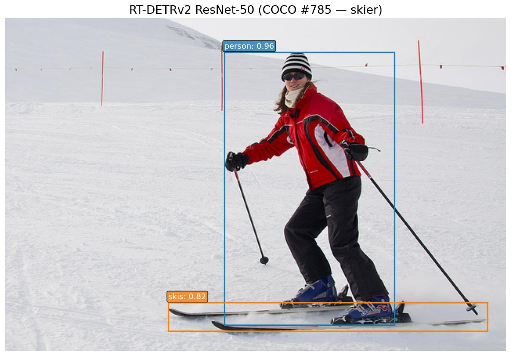

# RT-DETRv2

**Paper**: [RT-DETRv2: Improved Baseline with Bag-of-Freebies for Real-Time Detection Transformers](https://arxiv.org/abs/2407.17140)

RT-DETRv2 is the second-generation Real-Time DEtection TRansformer, building on the [RT-DETR](rt_detr.md) hybrid encoder + deformable-decoder design. v2 introduces a **selective multi-scale feature extractor** with a learnable per-level sampling-points scale (`n_points_scale`) in the deformable cross-attention, plus a refined training recipe ("bag-of-freebies"). The architecture and inference pipeline are otherwise identical to v1, so v1 and v2 weights are not interchangeable but the API surface is the same.

## Architecture Highlights

- **ResNet-vd Backbone:** 3-convolution stem variant of ResNet with average-pooling shortcuts.
- **Hybrid Encoder (AIFI + CCFM):** Attention-based Intra-scale Feature Interaction on the highest-level features, combined with Cross-scale Feature Fusion via FPN top-down and PAN bottom-up paths with CSPRepLayer blocks.
- **Selective Multi-Scale Deformable Decoder:** v2 merges the per-level sampling offsets into a single dimension and scales them with a learned `n_points_scale` buffer, letting the model adapt the sampling radius per level instead of using a fixed grid.
- **Two-Stage Query Init:** Encoder proposals initialize decoder queries, eliminating the need for learned query embeddings.
- **Iterative Box Refinement:** Each decoder layer refines bounding box predictions from the previous layer.

## Available Models

| Model | Backbone | Params | Weights |
|-------|----------|--------|---------|
| `RTDETRV2ResNet18` | ResNet-18-vd | 20M | `coco` |
| `RTDETRV2ResNet34` | ResNet-34-vd | 31M | `coco` |
| `RTDETRV2ResNet50` | ResNet-50-vd | 43M | `coco` |
| `RTDETRV2ResNet101` | ResNet-101-vd | 76M | `coco` |

## Basic Usage

```python
import kmodels

# RT-DETRv2 with ResNet-50 backbone (COCO pre-trained)
model = kmodels.models.rt_detr_v2.RTDETRV2ResNet50(weights="coco")

# Available variants
model = kmodels.models.rt_detr_v2.RTDETRV2ResNet18(weights="coco")
model = kmodels.models.rt_detr_v2.RTDETRV2ResNet34(weights="coco")
model = kmodels.models.rt_detr_v2.RTDETRV2ResNet101(weights="coco")

# Without pre-trained weights
model = kmodels.models.rt_detr_v2.RTDETRV2ResNet50(weights=None)
```

## Example Inference

```python
import kmodels
from kmodels.models.rt_detr_v2 import RTDETRV2ImageProcessor, RTDETRV2PostProcessor
from PIL import Image

model = kmodels.models.rt_detr_v2.RTDETRV2ResNet50(weights="coco")

image = Image.open("image.jpg")
original_size = image.size[::-1]  # (H, W)

# Preprocess: resize to 640x640, rescale to [0, 1] (no ImageNet normalization)
processed = RTDETRV2ImageProcessor(image)

# Inference
output = model(processed, training=False)
# output["logits"]:     (1, 300, 80) — class logits per query
# output["pred_boxes"]: (1, 300, 4)  — normalized (cx, cy, w, h)

# Post-process: sigmoid, top-K selection, convert boxes to pixel coords
results = RTDETRV2PostProcessor(output, threshold=0.5, target_sizes=[original_size])
for score, label, box in zip(results[0]["scores"], results[0]["label_names"], results[0]["boxes"]):
    print(f"{label}: {score:.2f} at [{box[0]:.0f}, {box[1]:.0f}, {box[2]:.0f}, {box[3]:.0f}]")

# Output (COCO val2017 #463730 — busy street):
# car: 0.94 at [510, 185, 640, 323]
# bus: 0.94 at [196, 108, 320, 272]
# person: 0.93 at [129, 185, 189, 313]
# bus: 0.91 at [369, 80, 543, 291]
# person: 0.86 at [300, 176, 330, 275]
# ...
```

## Full Inference with Visualization

```python
import os
os.environ["KERAS_BACKEND"] = "torch"

import numpy as np
from PIL import Image
import matplotlib
matplotlib.use("Agg")
import matplotlib.pyplot as plt

from kmodels.models.rt_detr_v2 import (
    RTDETRV2ResNet50,
    RTDETRV2ImageProcessor,
    RTDETRV2PostProcessor,
)

model = RTDETRV2ResNet50(weights="coco")

img = Image.open("image.jpg").convert("RGB")
original_size = img.size[::-1]  # (H, W)

processed = RTDETRV2ImageProcessor(img)
output = model(processed, training=False)

results = RTDETRV2PostProcessor(output, threshold=0.5, target_sizes=[original_size])

COLORS = plt.cm.tab10.colors

fig, ax = plt.subplots(1, 1, figsize=(10, 7))
ax.imshow(np.array(img))

for i, (score, label, box) in enumerate(zip(results[0]["scores"], results[0]["label_names"], results[0]["boxes"])):
    color = COLORS[i % len(COLORS)]
    x1, y1, x2, y2 = [float(x) for x in box]
    rect = plt.Rectangle((x1, y1), x2 - x1, y2 - y1, linewidth=2, edgecolor=color, facecolor="none")
    ax.add_patch(rect)
    ax.text(x1, y1 - 5, f"{label}: {float(score):.2f}", fontsize=11, color="white",
            bbox=dict(boxstyle="round,pad=0.2", facecolor=color, alpha=0.8))

ax.set_title("RT-DETRv2 Object Detection", fontsize=16)
ax.axis("off")
plt.tight_layout()
fig.savefig("rt_detr_v2_output.jpg", bbox_inches="tight", dpi=120)
plt.close(fig)
```



## Custom Dataset Usage

When using a model fine-tuned on a custom dataset, pass your class names to the post-processor via `label_names`:

```python
MY_CLASSES = ["cat", "dog", "bird"]

results = RTDETRV2PostProcessor(output, threshold=0.5,
    target_sizes=[original_size], label_names=MY_CLASSES)
```

If `label_names` is not provided, COCO class names are used by default.

## Preprocessing Notes

Like RT-DETRv1, RT-DETRv2 does **not** apply ImageNet normalization. The model expects input images rescaled to `[0, 1]` (divide by 255) and resized to `640x640`. The `RTDETRV2ImageProcessor` handles this automatically.
