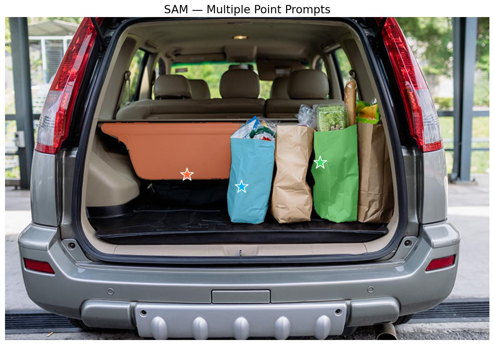

# SAM (Segment Anything Model)

## Overview

SAM (Segment Anything Model) is a promptable segmentation model that can generate high-quality segmentation masks for any object in an image, given input prompts such as points, bounding boxes, or masks. It was trained on the SA-1B dataset containing over 1 billion masks on 11 million images.

**Reference:** [Segment Anything](https://arxiv.org/abs/2304.02643) (Kirillov et al., 2023)

## Architecture Highlights

- **Promptable Object Segmentation:** Naturally accepts ambiguous or explicit prompts in the form of interactive points, bounding boxes, or dense masks.
- **Zero-Shot Generalization:** Delivers high-quality masks out-of-the-box on novel domains and unseen subjects without retraining.
- **Three-Part Pipeline:** Features a robust ViT Image Encoder, a flexible sparse/dense Prompt Encoder, and a lightweight two-way Mask Decoder for lightning-fast prompting.
- **Ambiguity Awareness:** Generates multiple valid segmentation mask hypotheses when a prompt is underspecified (e.g. part vs whole).

## Available Models

| Model | Parameters | Description | Weights |
|-------|-----------|-------------|---------|
| `SAM_ViT_Base` | ~93M | ViT-B/16 backbone | `sa1b` |
| `SAM_ViT_Large` | ~308M | ViT-L/16 backbone | `sa1b` |
| `SAM_ViT_Huge` | ~636M | ViT-H/16 backbone | `sa1b` |

## Basic Usage

```python
import kmodels

# List available SAM models
print(kmodels.list_models("sam"))

# Create a SAM model (default 1024x1024 input)
model = kmodels.models.sam.SAM_ViT_Base(
    input_shape=(1024, 1024, 3),
    weights="sa1b",
)
```

## Inference with Point Prompts

```python
import numpy as np
import keras
from kmodels.models.sam import SAM_ViT_Base, SAMImageProcessorWithPrompts, SAMPostProcessMasks

# Load model
model = SAM_ViT_Base(input_shape=(1024, 1024, 3), weights="sa1b")

# Segment multiple objects by running separate point prompts
prompts = [
    {"points": np.array([[[390, 280]]]), "labels": np.array([[1]])},  # blue bag
    {"points": np.array([[[300, 260]]]), "labels": np.array([[1]])},  # left brown bag
    {"points": np.array([[[520, 240]]]), "labels": np.array([[1]])},  # right brown bag
]

for prompt in prompts:
    inputs = SAMImageProcessorWithPrompts(
        "groceries.jpg",
        input_points=prompt["points"],  # (x, y) pixel coordinates
        input_labels=prompt["labels"],  # 1 = foreground
    )

    outputs = model({
        "pixel_values": inputs["pixel_values"],
        "input_points": inputs["input_points"],
        "input_labels": inputs["input_labels"],
    })

    masks = SAMPostProcessMasks(
        outputs["pred_masks"],
        original_size=inputs["original_size"],
        reshaped_size=inputs["reshaped_size"],
    )

    iou_scores = keras.ops.convert_to_numpy(outputs["iou_scores"])[0, 0]
    best_idx = np.argmax(iou_scores)
    best_mask = keras.ops.convert_to_numpy(masks)[0, 0, best_idx] > 0.0
    print(f"IoU: {iou_scores[best_idx]:.3f}, Mask shape: {best_mask.shape}")
```

## Full Inference with Visualization

```python
import os
os.environ["KERAS_BACKEND"] = "torch"

import numpy as np
import keras
from PIL import Image
import matplotlib
matplotlib.use("Agg")
import matplotlib.pyplot as plt

from kmodels.models.sam import (
    SAM_ViT_Base,
    SAMImageProcessorWithPrompts,
    SAMPostProcessMasks,
)

COLORS = [
    np.array([0, 180, 255, 128]) / 255.0,    # cyan
    np.array([255, 100, 50, 128]) / 255.0,    # orange
    np.array([50, 220, 100, 128]) / 255.0,    # green
]


def show_mask(mask, ax, color):
    h, w = mask.shape
    mask_image = mask.reshape(h, w, 1) * color.reshape(1, 1, -1)
    ax.imshow(mask_image)


def show_points(coords, ax, color, marker_size=375):
    ax.scatter(coords[:, 0], coords[:, 1], color=color, marker="*",
               s=marker_size, edgecolors="white", linewidths=1.25, zorder=5)


model = SAM_ViT_Base(input_shape=(1024, 1024, 3), weights="sa1b")
img = Image.open("groceries.jpg").convert("RGB")

prompts = [
    {"points": np.array([[[390, 280]]]), "labels": np.array([[1]]), "name": "blue bag"},
    {"points": np.array([[[300, 260]]]), "labels": np.array([[1]]), "name": "left brown bag"},
    {"points": np.array([[[520, 240]]]), "labels": np.array([[1]]), "name": "right brown bag"},
]

fig, ax = plt.subplots(1, 1, figsize=(10, 7))
ax.imshow(np.array(img))

for i, prompt in enumerate(prompts):
    inputs = SAMImageProcessorWithPrompts(
        img,
        input_points=prompt["points"],
        input_labels=prompt["labels"],
    )

    outputs = model({
        "pixel_values": inputs["pixel_values"],
        "input_points": inputs["input_points"],
        "input_labels": inputs["input_labels"],
    })

    masks = SAMPostProcessMasks(
        outputs["pred_masks"],
        original_size=inputs["original_size"],
        reshaped_size=inputs["reshaped_size"],
    )

    masks_np = keras.ops.convert_to_numpy(masks)[0, 0]
    iou_scores = keras.ops.convert_to_numpy(outputs["iou_scores"])[0, 0]
    best_idx = np.argmax(iou_scores)
    best_mask = masks_np[best_idx] > 0.0

    color = COLORS[i]
    show_mask(best_mask, ax, color)
    show_points(prompt["points"][0], ax, color=color[:3])
    print(f"  {prompt['name']}: IoU={iou_scores[best_idx]:.3f}")

ax.set_title("SAM — Multiple Point Prompts", fontsize=16)
ax.axis("off")
plt.tight_layout()
fig.savefig("sam_output.jpg", bbox_inches="tight", dpi=120)
plt.close(fig)
```



## Inference with Box Prompts

Box prompts are encoded as two corner points with special labels (`2` = top-left, `3` = bottom-right):

```python
import numpy as np
from kmodels.models.sam import SAM_ViT_Base, SAMImageProcessorWithPrompts, SAMPostProcessMasks

model = SAM_ViT_Base(input_shape=(1024, 1024, 3), weights="sa1b")

# Box [x1, y1, x2, y2] encoded as corner points
box = [100, 200, 400, 500]
inputs = SAMImageProcessorWithPrompts(
    "photo.jpg",
    input_points=np.array([[[box[0], box[1]], [box[2], box[3]]]]),
    input_labels=np.array([[2, 3]]),  # 2=top-left, 3=bottom-right
)

outputs = model({
    "pixel_values": inputs["pixel_values"],
    "input_points": inputs["input_points"],
    "input_labels": inputs["input_labels"],
})

masks = SAMPostProcessMasks(
    outputs["pred_masks"],
    original_size=inputs["original_size"],
    reshaped_size=inputs["reshaped_size"],
)
```

## Architecture

SAM consists of three main components:

1. **Vision Encoder (Image Encoder):** A ViT backbone with windowed attention and relative positional embeddings. Processes the input image (1024×1024) into a dense feature map (64×64×256).

2. **Prompt Encoder:** Encodes sparse prompts (points, boxes) via positional encoding + learned type embeddings, and dense prompts (masks) via a small CNN.

3. **Mask Decoder:** A lightweight two-way transformer (2 layers) that attends between prompt tokens and image embeddings, then generates mask predictions and IoU confidence scores.

## Model Outputs

The model returns a dictionary with:
- `pred_masks`: Low-resolution predicted masks of shape `(batch, point_batch, num_masks, 256, 256)`
- `iou_scores`: Predicted IoU scores for each mask of shape `(batch, point_batch, num_masks)`

Use `SAMPostProcessMasks` to upscale masks to the original image resolution.
