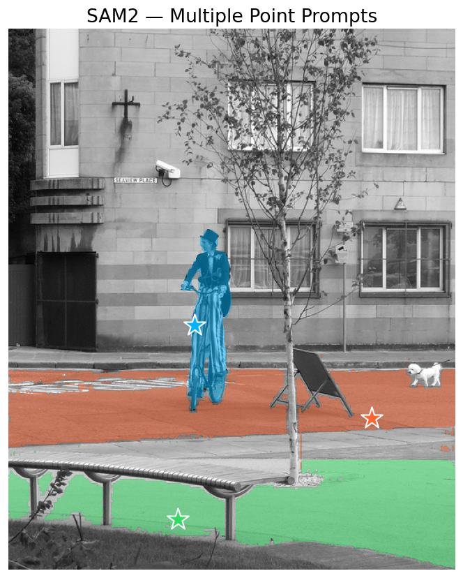

# SAM2 (Segment Anything Model 2)

## Overview

SAM2 (Segment Anything Model 2) is the next generation of the Segment Anything Model, designed for promptable segmentation in both images and videos. It features a Hiera hierarchical vision transformer backbone with improved efficiency and performance. SAM2 introduces object score prediction and high-resolution feature skip connections for enhanced mask quality.

**Reference:** [SAM 2: Segment Anything in Images and Videos](https://arxiv.org/abs/2408.00714) (Ravi et al., 2024)

For temporal video tracking with memory attention, see [SAM2 Video](sam2_video.md).

## Available Models

| Model         | Parameters | Backbone     | Description                       | Weights |
|---------------|-----------|--------------|-----------------------------------|---------|
| `Sam2Tiny`    | ~38M      | Hiera-Tiny   | Smallest and fastest variant      | `sav`   |
| `Sam2Small`   | ~46M      | Hiera-Small  | Balanced speed and accuracy       | `sav`   |
| `Sam2BasePlus`| ~80M      | Hiera-Base+  | Enhanced base model               | `sav`   |
| `Sam2Large`   | ~224M     | Hiera-Large  | Largest and most accurate         | `sav`   |

All models use a 1024×1024 input resolution and are trained on the SA-V dataset (Segment Anything in Videos).

## Basic Usage

```python
import kmodels

# List available SAM2 models
print(kmodels.list_models("sam2"))

# Create a SAM2 model (default 1024x1024 input)
model = kmodels.models.sam2.Sam2Tiny(
    input_shape=(1024, 1024, 3),
    weights="sav",
)
```

## Image Processor

`kmodels.models.sam2` ships a pure-Keras image processor that mirrors HuggingFace `Sam2ImageProcessor`: resize a frame to 1024×1024 with antialiased bilinear, rescale to `[0, 1]`, normalize with ImageNet mean/std, and prepare prompt tensors. Three helpers are exported:

- `Sam2ImageProcessor(image)` — preprocess one image and return default empty prompt placeholders.
- `Sam2ImageProcessorWithPrompts(image, input_points, input_labels)` — same as above plus encoded point prompts (per-axis stretched into 1024-space).
- `Sam2PostProcessMasks(pred_masks, original_size)` — bilinear-resize predicted masks back to the original image resolution.

```python
import numpy as np
from kmodels.models.sam2 import (
    Sam2Tiny,
    Sam2ImageProcessor,
    Sam2ImageProcessorWithPrompts,
    Sam2PostProcessMasks,
)

model = Sam2Tiny(input_shape=(1024, 1024, 3), weights="sav")

# Single foreground point prompt at the center of the original image
inputs = Sam2ImageProcessorWithPrompts(
    "photo.jpg",
    input_points=np.array([[[450, 600]]], dtype=np.float32),
    input_labels=np.array([[1]], dtype=np.int32),
)

# The model only consumes pixel_values + input_points + input_labels;
# original_size and reshaped_size are kept for post-processing.
model_inputs = {
    "pixel_values": inputs["pixel_values"],
    "input_points": inputs["input_points"],
    "input_labels": inputs["input_labels"],
}
outputs = model(model_inputs)

masks = Sam2PostProcessMasks(
    outputs["pred_masks"], original_size=inputs["original_size"]
)
print(masks.shape)  # (batch, num_prompts, num_multimask_outputs, orig_h, orig_w)
```

The processor accepts file paths, PIL images, and NumPy `(H, W, 3)` arrays.

## Inference with Point Prompts

```python
import numpy as np
import keras
from kmodels.models.sam2 import Sam2Large, Sam2ImageProcessorWithPrompts

model = Sam2Large(input_shape=(1024, 1024, 3), weights="sav")

# Foreground point in original image pixel coordinates
inputs = Sam2ImageProcessorWithPrompts(
    "photo.jpg",
    input_points=np.array([[[450, 600]]], dtype=np.float32),
    input_labels=np.array([[1]], dtype=np.int32),
)

outputs = model({
    "pixel_values": inputs["pixel_values"],
    "input_points": inputs["input_points"],
    "input_labels": inputs["input_labels"],
})

masks = outputs["pred_masks"]                   # (1, 1, 3, 256, 256)
iou_scores = outputs["iou_scores"]              # (1, 1, 3)
object_score_logits = outputs["object_score_logits"]  # (1, 1, 1)
```

## Inference with Box Prompts

```python
import numpy as np
from kmodels.models.sam2 import Sam2Small, Sam2ImageProcessorWithPrompts

model = Sam2Small(input_shape=(1024, 1024, 3), weights="sav")

# A box is encoded as two corner points: top-left + bottom-right.
# Coordinates are in original image pixel space.
box_corners = np.array([[[100, 200], [400, 500]]], dtype=np.float32)
# Labels: 2 = top-left corner, 3 = bottom-right corner
box_labels = np.array([[2, 3]], dtype=np.int32)

inputs = Sam2ImageProcessorWithPrompts(
    "photo.jpg",
    input_points=box_corners,
    input_labels=box_labels,
)

outputs = model({
    "pixel_values": inputs["pixel_values"],
    "input_points": inputs["input_points"],
    "input_labels": inputs["input_labels"],
})
```

## Multiple Point Prompts

```python
import numpy as np
from kmodels.models.sam2 import Sam2Small, Sam2ImageProcessorWithPrompts

model = Sam2Small(input_shape=(1024, 1024, 3), weights="sav")

# Three points for a single object: 2 foreground, 1 background
inputs = Sam2ImageProcessorWithPrompts(
    "photo.jpg",
    input_points=np.array([[[450, 600], [500, 650], [400, 550]]], dtype=np.float32),
    input_labels=np.array([[1, 1, 0]], dtype=np.int32),
)

outputs = model({
    "pixel_values": inputs["pixel_values"],
    "input_points": inputs["input_points"],
    "input_labels": inputs["input_labels"],
})
```

## Architecture

SAM2 consists of three main components:

1. **Hiera Backbone (Image Encoder):** A hierarchical vision transformer with:
   - Multi-scale blocks with windowed and global attention
   - Query pooling at stage transitions for efficiency
   - Windowed positional embeddings
   - FPN (Feature Pyramid Network) neck with sine-cosine positional encodings
   - Processes 1024×1024 input into multi-scale features (64×64, 128×128, 256×256)

2. **Prompt Encoder:** Encodes sparse prompts (points, boxes) via random Fourier feature positional encoding with learned type embeddings, and dense prompts (masks) via a small CNN. Shared positional embedding layer with image encoder.

3. **Mask Decoder:** A lightweight two-way transformer (2 layers) that:
   - Jointly attends between prompt tokens and image embeddings
   - Uses high-resolution feature skip connections from FPN
   - Generates mask predictions via hypernetwork MLPs
   - Predicts IoU confidence scores (with sigmoid activation)
   - Predicts object-presence scores (logits)

## Model Outputs

The model returns a dictionary with:
- `pred_masks`: Predicted masks of shape `(batch, num_prompts, num_multimask_outputs, 256, 256)`
  - By default, `num_multimask_outputs=3` (excludes the single-mask output)
  - Masks are at 4× the image embedding resolution
- `iou_scores`: Predicted IoU scores (0-1) for each mask of shape `(batch, num_prompts, num_multimask_outputs)`
  - Sigmoid-activated confidence scores
- `object_score_logits`: Object presence score logits of shape `(batch, num_prompts, 1)`
  - Raw logits indicating whether a valid object is present

## Key Improvements over SAM v1

1. **Hiera Backbone:** More efficient hierarchical architecture with better speed/accuracy tradeoff
2. **Multi-scale Features:** FPN provides features at multiple resolutions with skip connections
3. **Object Score Prediction:** Additional head to predict object presence
4. **Improved Mask Quality:** High-resolution skip connections enhance fine details
5. **Video Support:** A separate `Sam2Video` family extends this architecture with memory attention, a memory encoder, and an object pointer projection for promptable video segmentation. See [SAM2 Video](sam2_video.md).

## Prompt Label Convention

- `1`: Foreground point
- `0`: Background point
- `2`: Box top-left corner
- `3`: Box bottom-right corner
- `-1`: Padding (ignored)
- `-10`: Zero embedding (special case)

## Performance Tips

1. **Model Selection:**
   - Use `Sam2Tiny` for real-time applications
   - Use `Sam2Small` for balanced performance
   - Use `Sam2Large` for highest quality

2. **Prompt Strategy:**
   - Start with a single foreground point
   - Add background points to refine boundaries
   - Use boxes for objects with clear rectangular bounds
   - Combine multiple points for complex shapes

3. **Mask Selection:**
   - The model outputs 3 masks by default
   - Use `iou_scores` to select the best mask
   - Higher IoU score indicates better mask quality

## Example: Complete Workflow

```python
import numpy as np
import keras
from PIL import Image

from kmodels.models.sam2 import (
    Sam2Tiny,
    Sam2ImageProcessorWithPrompts,
    Sam2PostProcessMasks,
)

# Build the model
model = Sam2Tiny(input_shape=(1024, 1024, 3), weights="sav")

# Preprocess the image and a single foreground point in original pixel space
inputs = Sam2ImageProcessorWithPrompts(
    "photo.jpg",
    input_points=np.array([[[450, 600]]], dtype=np.float32),
    input_labels=np.array([[1]], dtype=np.int32),
)

# Run inference
outputs = model({
    "pixel_values": inputs["pixel_values"],
    "input_points": inputs["input_points"],
    "input_labels": inputs["input_labels"],
})

# Select the best mask using IoU scores, in low resolution (256x256)
masks_low = keras.ops.convert_to_numpy(outputs["pred_masks"])[0, 0]  # (3, 256, 256)
iou_scores = keras.ops.convert_to_numpy(outputs["iou_scores"])[0, 0]
best_idx = int(np.argmax(iou_scores))

# Resize all 3 mask logits back to original image resolution
masks_full = keras.ops.convert_to_numpy(
    Sam2PostProcessMasks(
        outputs["pred_masks"], original_size=inputs["original_size"]
    )
)[0, 0]  # (3, orig_h, orig_w)
best_mask = masks_full[best_idx] > 0

print(f"Best mask IoU: {iou_scores[best_idx]:.3f}")
print(f"Object score: {keras.ops.sigmoid(outputs['object_score_logits'][0, 0, 0]):.3f}")
print(f"Mask shape: {best_mask.shape} (orig_h, orig_w)")
```

## Full Inference with Visualization

```python
import os
os.environ["KERAS_BACKEND"] = "torch"

import numpy as np
import keras
from PIL import Image
import matplotlib
matplotlib.use("Agg")
import matplotlib.pyplot as plt

from kmodels.models.sam2 import (
    Sam2Tiny,
    Sam2ImageProcessorWithPrompts,
    Sam2PostProcessMasks,
)

COLORS = [
    np.array([0, 180, 255, 128]) / 255.0,    # cyan
    np.array([255, 100, 50, 128]) / 255.0,    # orange
    np.array([50, 220, 100, 128]) / 255.0,    # green
]


def show_mask(mask, ax, color):
    h, w = mask.shape
    mask_image = mask.reshape(h, w, 1) * color.reshape(1, 1, -1)
    ax.imshow(mask_image)


def show_points(coords, ax, color, marker_size=375):
    ax.scatter(
        coords[0], coords[1], color=color, marker="*",
        s=marker_size, edgecolors="white", linewidths=1.25, zorder=5,
    )


model = Sam2Tiny(input_shape=(1024, 1024, 3), weights="sav")
img = Image.open("cyclist.jpg").convert("RGB")
img_np = np.array(img)
original_size_wh = img.size  # (W, H)

# One foreground point per object, in original pixel space
prompts = [
    {"point": (430, 540), "name": "cyclist"},
    {"point": (840, 720), "name": "dog"},
    {"point": (390, 900), "name": "bench"},
]

fig, ax = plt.subplots(1, 1, figsize=(10, 7))
ax.imshow(img_np)

for i, prompt in enumerate(prompts):
    px, py = prompt["point"]
    inputs = Sam2ImageProcessorWithPrompts(
        img_np,
        input_points=np.array([[[px, py]]], dtype=np.float32),
        input_labels=np.array([[1]], dtype=np.int32),
    )
    outputs = model({
        "pixel_values": inputs["pixel_values"],
        "input_points": inputs["input_points"],
        "input_labels": inputs["input_labels"],
    })

    iou_scores = keras.ops.convert_to_numpy(outputs["iou_scores"])[0, 0]
    best_idx = int(np.argmax(iou_scores))

    masks_full = keras.ops.convert_to_numpy(
        Sam2PostProcessMasks(
            outputs["pred_masks"], original_size=inputs["original_size"]
        )
    )[0, 0]
    best_mask = masks_full[best_idx] > 0

    show_mask(best_mask, ax, COLORS[i])
    show_points((px, py), ax, color=COLORS[i][:3])
    print(f"  {prompt['name']}: IoU={iou_scores[best_idx]:.3f}")

ax.set_title("SAM2 — Multiple Point Prompts", fontsize=16)
ax.axis("off")
plt.tight_layout()
fig.savefig("sam2_output.jpg", bbox_inches="tight", dpi=120)
plt.close(fig)
```



## Citation

```bibtex
@article{ravi2024sam2,
  title={SAM 2: Segment Anything in Images and Videos},
  author={Ravi, Nikhila and Gabeur, Valentin and Hu, Yuan-Ting and Hu, Ronghang and Ryali, Chaitanya and Ma, Tengyu and Khedr, Haitham and R{\"a}dle, Roman and Rolland, Chloe and Gustafson, Laura and others},
  journal={arXiv preprint arXiv:2408.00714},
  year={2024}
}
```
