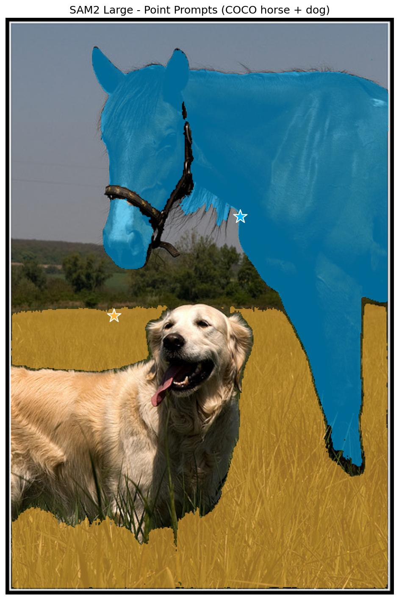
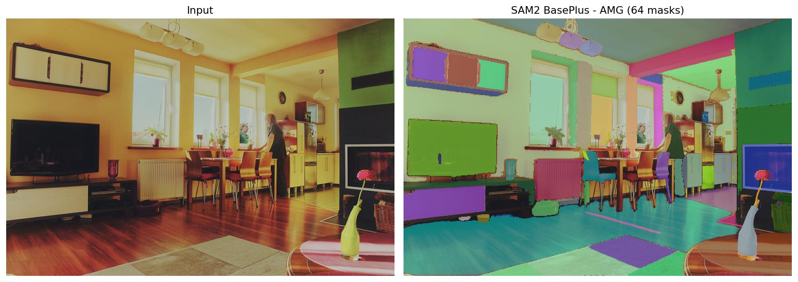

# SAM2 (Segment Anything Model 2)

## Overview

SAM2 (Segment Anything Model 2) is the next generation of the Segment Anything Model, designed for promptable segmentation in both images and videos. It features a Hiera hierarchical vision transformer backbone with improved efficiency and mask quality, object-presence prediction, and high-resolution feature skip connections in the mask decoder.

**Reference:** [SAM 2: Segment Anything in Images and Videos](https://arxiv.org/abs/2408.00714) (Ravi et al., 2024)

For temporal video tracking with memory attention, see [SAM2 Video](sam2_video.md).

## Architecture Highlights

- **Hiera Backbone:** Hierarchical vision transformer with windowed / global attention, query pooling at stage transitions, and an FPN neck that emits multi-scale features (64×64, 128×128, 256×256).
- **Promptable Segmentation:** Accepts points, boxes, and (optional) dense mask prompts through a lightweight sparse/dense prompt encoder.
- **High-Res Feature Skip:** The mask decoder mixes the coarse image embedding with the FPN's high-resolution feature maps, producing sharper masks than SAM v1.
- **Object Score Head:** An extra head predicts whether a valid object is actually present, usable as a rejection signal for weak prompts.
- **Ambiguity Awareness:** Like SAM v1, predicts multiple valid mask hypotheses for underspecified prompts (part vs whole).

## Available Models

| Model         | Parameters | Backbone     | Description                       | Weights |
|---------------|-----------|--------------|-----------------------------------|---------|
| `Sam2Tiny`    | ~38M      | Hiera-Tiny   | Smallest and fastest variant      | `sav`   |
| `Sam2Small`   | ~46M      | Hiera-Small  | Balanced speed and accuracy       | `sav`   |
| `Sam2BasePlus`| ~80M      | Hiera-Base+  | Enhanced base model               | `sav`   |
| `Sam2Large`   | ~224M     | Hiera-Large  | Largest and most accurate         | `sav`   |

All models use a 1024×1024 input resolution and are trained on the SA-V dataset (Segment Anything in Videos).

## Basic Usage

```python
import kmodels

# List available SAM2 models
print(kmodels.list_models("sam2"))

# Build a SAM2 model (default 1024x1024 input, 3-mask output)
model = kmodels.models.sam2.Sam2Tiny(
    input_shape=(1024, 1024, 3),
    weights="sav",
)

# For single best-mask output (HF ``multimask_output=False`` path):
model_single = kmodels.models.sam2.Sam2Tiny(
    weights="sav",
    multimask_output=False,
)
```

`multimask_output` is a **construction-time** flag in the Keras port (unlike the HuggingFace `Sam2Model` where it is a runtime kwarg). Building with `multimask_output=False` also wires in the HF-parity dynamic-stability fallback: the single-mask token is preferred when its stability score clears `0.98`, otherwise the argmax-IoU multi-mask token is used.

## Model Inputs

The default SAM2 functional graph has three inputs. Box and dense-mask prompts are opt-in via constructor flags (`include_box_input`, `include_mask_input`) that extend the input dict.

| Input | Shape | Notes |
|---|---|---|
| `pixel_values` | `(batch, 1024, 1024, 3)` | Normalized image (ImageNet mean/std), stretch-to-1024. |
| `input_points` | `(batch, point_batch, num_points, 2)` | `(x, y)` pixel coords in the **model input** frame (1024-space). |
| `input_labels` | `(batch, point_batch, num_points)` | `1` foreground, `0` background, `-1` padding. |
| `input_boxes` *(opt-in)* | `(batch, num_boxes, 4)` | `(x1, y1, x2, y2)`. Present only when `include_box_input=True`. `num_boxes` doubles as the sparse-embedding `point_batch` axis. |
| `input_masks` *(opt-in)* | `(batch, 256, 256, 1)` | Dense mask prompt at 4× downscale. Present only when `include_mask_input=True`. |
| `has_input_masks` *(opt-in)* | `(batch,)` | Gate (0/1) for the dense mask embedding vs the learned no-mask fallback. |

## Inference with Point Prompts

```python
import numpy as np
import keras
from kmodels.models.sam2 import (
    Sam2Large, Sam2ImageProcessorWithPrompts, Sam2PostProcessMasks,
)

model = Sam2Large(input_shape=(1024, 1024, 3), weights="sav")

# Foreground point in original image pixel coordinates
inputs = Sam2ImageProcessorWithPrompts(
    input_points=np.array([[[450, 600]]], dtype=np.float32),
    input_labels=np.array([[1]], dtype=np.int32)
)("photo.jpg")

outputs = model({
    "pixel_values": inputs["pixel_values"],
    "input_points": inputs["input_points"],
    "input_labels": inputs["input_labels"],
})

masks = Sam2PostProcessMasks(
    outputs["pred_masks"], original_size=inputs["original_size"]
)
iou_scores = keras.ops.convert_to_numpy(outputs["iou_scores"])[0, 0]
best_idx = int(np.argmax(iou_scores))
best_mask = keras.ops.convert_to_numpy(masks)[0, 0, best_idx] > 0.0
print(f"IoU: {iou_scores[best_idx]:.3f}, Mask shape: {best_mask.shape}")
```

### Data format

Every processor and format-sensitive post-processor in this module accepts a `data_format=None` kwarg. The default (`None`) resolves to `keras.config.image_data_format()`; pass `"channels_first"` or `"channels_last"` to override per-call without touching global state.

```python
# follow the global config (the default)
inputs = Sam2ImageProcessor()("photo.jpg")

# force channels_first for this call only
inputs = Sam2ImageProcessor(data_format="channels_first")("photo.jpg")
```

Image processors return tensors in the requested layout; post-processors accept tensors in either layout and read the flag to pick the channel axis. See `docs/utils.md` for which families have format-sensitive post-processors.

## Inference with Box Prompts

SAM2 supports two box-prompt paths:

1. **Point-encoding workaround** (no model rebuild): encode each box as two points with labels `2` (top-left) and `3` (bottom-right). Works with the default SAM2 model.
2. **Native `input_boxes` input** (opt-in via `include_box_input=True`): exposes a dedicated `input_boxes` input tensor. Matches the HuggingFace reference bit-for-bit when at least one point is supplied alongside the box.

### Point-encoding workaround

```python
import numpy as np
from kmodels.models.sam2 import Sam2Small, Sam2ImageProcessorWithPrompts

model = Sam2Small(input_shape=(1024, 1024, 3), weights="sav")

# A box is encoded as two corner points: top-left + bottom-right.
# Coordinates are in original image pixel space.
box_corners = np.array([[[100, 200], [400, 500]]], dtype=np.float32)
# Labels: 2 = top-left corner, 3 = bottom-right corner
box_labels = np.array([[2, 3]], dtype=np.int32)

inputs = Sam2ImageProcessorWithPrompts(
    input_points=box_corners,
    input_labels=box_labels
)("photo.jpg")

outputs = model({
    "pixel_values": inputs["pixel_values"],
    "input_points": inputs["input_points"],
    "input_labels": inputs["input_labels"],
})
```

### Native `input_boxes` path

```python
import numpy as np
from kmodels.models.sam2 import Sam2Small, Sam2ImageProcessorWithPrompts

model = Sam2Small(
    input_shape=(1024, 1024, 3),
    weights="sav",
    include_box_input=True,
)

inputs = Sam2ImageProcessorWithPrompts(
    input_points=np.array([[[450, 600]]], dtype=np.float32),
    input_labels=np.array([[1]], dtype=np.int32)
)("photo.jpg")
# Box input shape: (batch, num_boxes, 4) with (x1, y1, x2, y2) in
# original-image pixel coordinates. ``num_boxes`` acts as the
# ``point_batch`` axis in the sparse-embedding concat — supply one
# box per point batch.
input_boxes = np.array([[[100, 200, 400, 500]]], dtype=np.float32)

outputs = model({
    "pixel_values": inputs["pixel_values"],
    "input_points": inputs["input_points"],
    "input_labels": inputs["input_labels"],
    "input_boxes": input_boxes,
})
```

> **Note — pass a point alongside boxes for HF parity.**
> When `input_points is None`, HuggingFace's `Sam2Model` skips the point-encoding branch of the prompt encoder entirely. The Keras functional graph always runs that branch (its inputs are required), which injects a spurious "not a point" token into the sparse-prompt sequence and causes a small mask-logit drift on the pure box-only path. Supply at least one point alongside each box — even a dummy foreground point near the box center — to get bit-for-bit HF parity. Points + boxes matches HF within float32 noise (~1e-3 max mask diff across all four variants).

## Precomputed Image Embeddings (Multi-Prompt Inference)

For interactive tools that try many prompts on the same image, run the Hiera backbone + FPN **once** and reuse its output. Every SAM2 instance exposes two sub-models that share weights with the main model:

| Attribute | Inputs | Outputs |
|---|---|---|
| `model.vision_encoder_model` | `pixel_values` | `image_embeddings` `(1, 64, 64, 256)`, `high_res_feat_s0` `(1, 256, 256, 256)`, `high_res_feat_s1` `(1, 128, 128, 256)` |
| `model.prompt_decoder_model` | encoder outputs + `input_points` + `input_labels` *(+ optional boxes / mask inputs)* | `pred_masks`, `iou_scores`, `object_score_logits` |

```python
import numpy as np
import keras
from kmodels.models.sam2 import Sam2Tiny, Sam2ImageProcessor

model = Sam2Tiny(weights="sav")
pre = Sam2ImageProcessor()("photo.jpg")

# Run the Hiera + FPN encoder once
encoder_out = model.get_image_embeddings(pre["pixel_values"])

# Try many prompts without re-running the backbone
for (x, y) in [(450, 600), (200, 150), (700, 300)]:
    # Per-axis stretch from original pixel space into 1024-space.
    orig_h, orig_w = pre["original_size"]
    px = float(x) * 1024.0 / orig_w
    py = float(y) * 1024.0 / orig_h
    out = model.prompt_decoder_model({
        "image_embeddings":  encoder_out["image_embeddings"],
        "high_res_feat_s0":  encoder_out["high_res_feat_s0"],
        "high_res_feat_s1":  encoder_out["high_res_feat_s1"],
        "input_points":      keras.ops.convert_to_tensor(
            np.array([[[[px, py]]]], dtype="float32")
        ),
        "input_labels":      keras.ops.convert_to_tensor(
            np.array([[[1]]], dtype="int32")
        ),
    })
```

For a 1024×1024 image the Hiera backbone + FPN is the dominant cost; the mask decoder runs in milliseconds. This is the same path the built-in AMG driver uses under the hood.

> **Tensor types.** Keras refuses to mix torch tensors (encoder outputs) and numpy arrays (prompt inputs) in a single call dict. Wrap all the prompt inputs with `keras.ops.convert_to_tensor` as above so everything is on the active backend.

## Full Inference with Visualization

```python
import os
os.environ["KERAS_BACKEND"] = "torch"

import numpy as np
import keras
from PIL import Image
import matplotlib
matplotlib.use("Agg")
import matplotlib.pyplot as plt

from kmodels.models.sam2 import (
    Sam2Large, Sam2ImageProcessorWithPrompts, Sam2PostProcessMasks,
)

COLORS = [
    np.array([0, 180, 255, 150]) / 255.0,    # cyan — horse
    np.array([255, 180, 60, 150]) / 255.0,   # yellow — dog
]


def show_mask(mask, ax, color):
    h, w = mask.shape
    ax.imshow(mask.reshape(h, w, 1) * color.reshape(1, 1, -1))


def show_points(coords, ax, color, marker_size=340):
    ax.scatter(coords[0], coords[1], color=color, marker="*",
               s=marker_size, edgecolors="white", linewidths=1.25, zorder=5)


model = Sam2Large(input_shape=(1024, 1024, 3), weights="sav")
img = Image.open("assets/coco_horse_dog.jpg").convert("RGB")   # COCO val2017/000000049269.jpg
img_np = np.array(img)

# One foreground point per subject, in original pixel space
prompts = [
    {"point": (260, 220), "name": "horse"},
    {"point": (120, 330), "name": "dog"},
]

fig, ax = plt.subplots(1, 1, figsize=(10, 6))
ax.imshow(img_np)

for i, prompt in enumerate(prompts):
    px, py = prompt["point"]
    inputs = Sam2ImageProcessorWithPrompts(
        input_points=np.array([[[px, py]]], dtype=np.float32),
        input_labels=np.array([[1]], dtype=np.int32)
)(img_np)
    outputs = model({
        "pixel_values": inputs["pixel_values"],
        "input_points": inputs["input_points"],
        "input_labels": inputs["input_labels"],
    })

    iou_scores = keras.ops.convert_to_numpy(outputs["iou_scores"])[0, 0]
    best_idx = int(np.argmax(iou_scores))

    masks_full = keras.ops.convert_to_numpy(
        Sam2PostProcessMasks(
            outputs["pred_masks"], original_size=inputs["original_size"]
        )
    )[0, 0]
    best_mask = masks_full[best_idx] > 0.0

    show_mask(best_mask, ax, COLORS[i])
    show_points((px, py), ax, color=COLORS[i][:3])
    print(f"  {prompt['name']}: IoU={iou_scores[best_idx]:.3f}")

ax.set_title("SAM2 Large — Point Prompts (COCO horse + dog)", fontsize=14)
ax.axis("off")
plt.tight_layout()
fig.savefig("sam2_horse_dog_output.jpg", bbox_inches="tight", dpi=130)
plt.close(fig)
```



Running this on the COCO horse-and-dog image (`val2017/000000049269.jpg`, saved locally as `assets/coco_horse_dog.jpg`) segments both subjects from a single point click each, with IoU scores > 0.95.

## Automatic Mask Generation ("Segment Everything")

Without any prompts, SAM2 can sample a dense point grid over the image and return every mask it can find. The Keras port ships both the HuggingFace-parity helpers and a driver that ties them together, using the `vision_encoder_model` / `prompt_decoder_model` sub-models so the Hiera backbone runs once per crop and the mask decoder runs once per point batch.

### What's where

HuggingFace's `Sam2ImageProcessor` exposes the AMG **helpers** (`generate_crop_boxes`, `filter_masks`, `post_process_for_mask_generation`, plus internals like `_compute_stability_score`, `_mask_to_rle`) but leaves the crop loop, per-crop batching, and model orchestration to you. Meta's original repo ships the end-to-end driver as `SAM2AutomaticMaskGenerator`.

The kmodels port provides:

| Function | What it corresponds to |
|---|---|
| `generate_crop_boxes` *(re-used from `kmodels.models.sam`)* | `Sam2ImageProcessor.generate_crop_boxes` |
| `filter_masks` *(re-used from `kmodels.models.sam`)* | `Sam2ImageProcessor.filter_masks` |
| `post_process_for_mask_generation` *(re-used from `kmodels.models.sam`)* | `Sam2ImageProcessor.post_process_for_mask_generation` |
| `Sam2GenerateMasks` | `SAM2AutomaticMaskGenerator` (Meta original) |

All helpers run on `keras.ops` tensors and work on any backend.

### One-call usage

```python
import os
os.environ["KERAS_BACKEND"] = "torch"

import numpy as np
import keras
from PIL import Image
import matplotlib
matplotlib.use("Agg")
import matplotlib.pyplot as plt

from kmodels.models.sam2 import Sam2BasePlus, Sam2GenerateMasks


def overlay_masks(ax, masks_list):
    rng = np.random.default_rng(7)
    ordered = sorted(
        [np.asarray(keras.ops.convert_to_numpy(m)).astype(bool) for m in masks_list],
        key=lambda m: -int(m.sum()),
    )
    h, w = ordered[0].shape
    overlay = np.zeros((h, w, 4), dtype=np.float32)
    for mask in ordered:
        color = np.concatenate([rng.random(3), [0.55]])
        overlay[mask] = color
    ax.imshow(overlay)


model = Sam2BasePlus(weights="sav")
img = Image.open("assets/coco_livingroom.jpg").convert("RGB")

result = Sam2GenerateMasks(
    model,
    np.array(img, dtype="float32"),
    points_per_side=16,          # 16 × 16 = 256 grid points
    points_per_batch=16,
    pred_iou_thresh=0.80,
    stability_score_thresh=0.85,
    crops_nms_thresh=0.7,
    crop_n_layers=0,             # set 1 or 2 for multi-scale crops
)

# result["masks"]      : list of bool (orig_h, orig_w) keras tensors
# result["iou_scores"] : (N,) float tensor
# result["boxes"]      : (N, 4) xyxy in original-image coords
# result["rle_masks"]  : list of uncompressed RLE dicts
print(f"Found {len(result['masks'])} masks")

fig, axes = plt.subplots(1, 2, figsize=(14, 6))
axes[0].imshow(np.array(img)); axes[0].set_title("Input"); axes[0].axis("off")
axes[1].imshow(np.array(img))
overlay_masks(axes[1], result["masks"])
axes[1].set_title(f"SAM2 BasePlus — AMG ({len(result['masks'])} masks)")
axes[1].axis("off")
plt.tight_layout()
fig.savefig("sam2_coco_livingroom_amg_output.jpg", bbox_inches="tight", dpi=130)
plt.close(fig)
```



Running on a living-room / dining-scene COCO image (`val2017/000000000139.jpg`, saved locally as `assets/coco_livingroom.jpg`) with a 16 × 16 point grid returns ~60 deduplicated masks — the TV, windows, radiator, dining chairs, table, vases, hardwood floor, rug, fireplace, ceiling lamp, refrigerator, person, and several of the wall pictures, all segmented separately.

Under the hood the driver:

1. Calls `generate_crop_boxes` to build the point grid (and optional crop hierarchy).
2. Runs `model.vision_encoder_model` once per crop, then calls `model.prompt_decoder_model` in batches of `points_per_batch`.
3. Applies `filter_masks` per crop (IoU threshold, stability score, crop-edge filter, pad back to original image, encode as RLE).
4. Applies `post_process_for_mask_generation` (single-class NMS on predicted boxes) to deduplicate across crops.

`Sam2GenerateMasks` requires a SAM2 model built with the default point-only prompt interface (`include_box_input=False`, `include_mask_input=False`) — it raises `ValueError` otherwise. If you need AMG alongside a box-enabled model, build two instances.

### Rolling your own driver

If you want HuggingFace-parity behavior exactly, import the helpers directly and skip `Sam2GenerateMasks`:

```python
from kmodels.models.sam import (
    generate_crop_boxes, filter_masks, post_process_for_mask_generation,
)
```

These are architecture-agnostic — the SAM2 AMG driver reuses the same helpers verbatim — so you can mirror any custom pipeline written against `transformers`' `Sam2ImageProcessor`.

## Architecture

SAM2 consists of three main components:

1. **Hiera Backbone + FPN:** Hierarchical vision transformer with multi-scale blocks, windowed and global attention, query pooling at stage transitions, windowed positional embeddings, and an FPN neck that produces `(64×64, 128×128, 256×256)` feature maps with sine-cosine positional encodings.
2. **Prompt Encoder:** Encodes sparse prompts (points, box corners) via random Fourier positional encoding + learned type embeddings, and dense prompts (masks) via a small CNN. Shares its positional embedding layer with the image encoder.
3. **Mask Decoder:** A lightweight two-way transformer (2 layers) that attends between prompt tokens and image embeddings, uses high-resolution FPN features as skip connections, and generates mask predictions via hypernetwork MLPs. Also predicts IoU confidence scores and object-presence logits.

## Model Outputs

The model returns a dictionary with:

- `pred_masks`: Low-resolution predicted masks of shape `(batch, point_batch, num_masks, 256, 256)`. `num_masks=3` for `multimask_output=True` (default) or `num_masks=1` for `multimask_output=False`.
- `iou_scores`: Predicted IoU scores (0–1, sigmoid-activated) for each mask of shape `(batch, point_batch, num_masks)`.
- `object_score_logits`: Object-presence score logits of shape `(batch, point_batch, 1)`. Raw logits — apply `sigmoid` if you want a probability.

Use `Sam2PostProcessMasks` to upscale masks to the original image resolution. The output is mask **logits** — threshold with `> 0` to get a binary mask (or whatever `mask_threshold` you prefer).

## HuggingFace API Parity Notes

The Keras port intentionally differs from the PyTorch/HuggingFace `Sam2Model` API in a few places due to the functional-graph constraint:

| Aspect | HuggingFace | Keras port |
|---|---|---|
| Optional prompts | pass `None` in `forward` | build-time flags (`include_box_input`, `include_mask_input`) + explicit inputs |
| `multimask_output` | runtime kwarg | construction-time flag |
| Precomputed embeddings | `model(image_embeddings=..., ...)` | `model.prompt_decoder_model(...)` sub-model |
| Post-processing | `processor.post_process_masks` (list per image) | `Sam2PostProcessMasks` (one image per call) |
| Automatic mask generation | helpers on `Sam2ImageProcessor`; driver lives in Meta's original repo | helpers re-used from `kmodels.models.sam` + built-in `Sam2GenerateMasks` driver |
| Image preprocessing | `keep_aspect_ratio=True` + pad to square | per-axis stretch to 1024×1024 |
| Box-only prompts | supported (points branch is skipped) | small drift — see the box-prompt note above |

All forward-pass weights are byte-equivalent to the HuggingFace checkpoints — across all four variants, `points`, `points + boxes`, and `multimask_output=False` paths match HF within float32 noise (~1e-3 max mask-logit diff).

## Citation

```bibtex
@article{ravi2024sam2,
  title={SAM 2: Segment Anything in Images and Videos},
  author={Ravi, Nikhila and Gabeur, Valentin and Hu, Yuan-Ting and Hu, Ronghang and Ryali, Chaitanya and Ma, Tengyu and Khedr, Haitham and R{\"a}dle, Roman and Rolland, Chloe and Gustafson, Laura and others},
  journal={arXiv preprint arXiv:2408.00714},
  year={2024}
}
```
