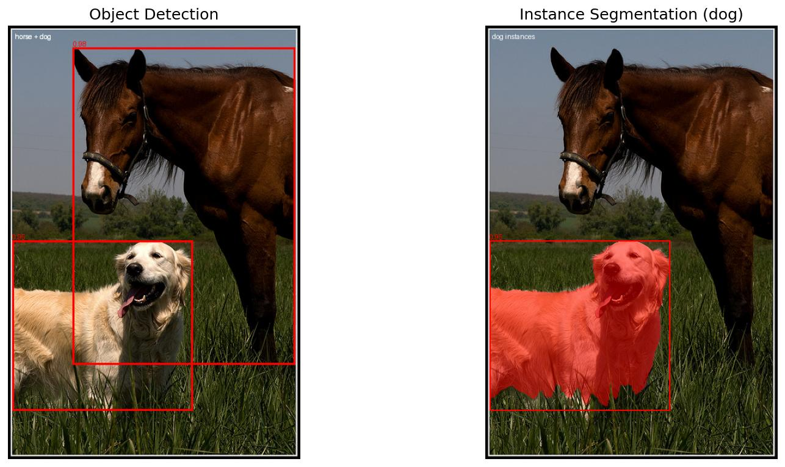

# SAM3 (Segment Anything Model 3)

## Overview

SAM3 is an open-vocabulary, promptable detection and segmentation model. It combines a ViT-L vision backbone with a DETR-style encoder/decoder for object detection, a CLIP text encoder for open-vocabulary understanding, and a mask decoder for instance and semantic segmentation. SAM3 supports text prompts, box prompts, or both for flexible inference.

**Reference:** [SAM 3: Segment Anything with Concepts](https://arxiv.org/abs/2511.16719) (Meta AI, 2025)

## Available Models

| Model | Parameters | Backbone | Description | Weights |
|-------|-----------|----------|-------------|---------|
| `SAM3` | ~839M | ViT-L/14 | Open-vocabulary detector + segmenter | `sam3` |

The model uses 1008x1008 input resolution and includes a CLIP text encoder (24 layers, 1024d) and geometry encoder for box prompts.

## Weights License

SAM3 weights are gated on HuggingFace. Before using `weights="saco"`:

1. Accept the license at https://huggingface.co/facebook/sam3
2. Authenticate: `huggingface-cli login` or set `export HF_TOKEN=<your_token>`

On first use, weights are downloaded, converted to Keras, and cached at `~/.cache/kmodels/sam3/`.

## Basic Usage

```python
from kmodels.models.sam3 import SAM3

# First call: downloads from HF, converts, caches (~5 min)
# Subsequent calls: loads from cache instantly
model = SAM3(input_shape=(1008, 1008, 3), weights="saco")
```

## Object Detection

```python
from kmodels.models.sam3.sam3_downstream import SAM3ObjectDetection
from PIL import Image

image = Image.open("photo.jpg")

detector = SAM3ObjectDetection(model)
results = detector.predict(images=image, text="cat")

for det in results:
    print(det["scores"], det["boxes"])
```

## Instance Segmentation

```python
from kmodels.models.sam3.sam3_downstream import SAM3InstanceSegmentation

segmenter = SAM3InstanceSegmentation(model)
results = segmenter.predict(images=image, text="cat")

for r in results:
    print(r["scores"].shape)   # (N,)
    print(r["boxes"].shape)    # (N, 4)
    print(r["masks"].shape)    # (N, H, W)
```

## Semantic Segmentation

```python
from kmodels.models.sam3.sam3_downstream import SAM3SemanticSegmentation

sem_seg = SAM3SemanticSegmentation(model)
masks = sem_seg.predict(images=image, text="cat")

# masks[0] is a (H, W) binary mask at original image size
print(f"Coverage: {100 * masks[0].sum() / masks[0].size:.1f}%")
```

## Box-Prompted Detection

```python
# Use detected boxes to refine with geometry encoder
results = detector.predict(
    images=image,
    text="cat",
    input_boxes=[[100, 50, 300, 400]],
)
```

## Visualization

```python
from kmodels.models.sam3.sam3_utils import (
    draw_detections,
    draw_instance_masks,
    draw_semantic_mask,
)

# Draw detection boxes
vis = draw_detections(image, results[0], title="cat detection")
vis.save("detection.jpg")

# Draw instance masks with colored overlays
vis = draw_instance_masks(image, results[0], title="cat instances")
vis.save("instance_seg.jpg")

# Draw semantic mask overlay
vis = draw_semantic_mask(image, masks[0], title="cat")
vis.save("semantic_seg.jpg")
```

## Pre-computed Features for Multi-Prompt Inference

When running multiple text prompts on the same image, compute vision features once and reuse:

```python
detector = SAM3ObjectDetection(model)

# Run backbone once
features = detector.get_vision_features(image)

# Run decoder per prompt (fast)
cats = detector.predict(vision_embeds=features, text="cat")
dogs = detector.predict(vision_embeds=features, text="dog")
cars = detector.predict(vision_embeds=features, text="car")
```

## Architecture

SAM3 consists of five main components:

1. **ViT-L Backbone:** 32-layer Vision Transformer with:
   - 1024d hidden size, 16 attention heads
   - 14x14 patch embedding (72x72 grid for 1008 input)
   - Windowed attention (window_size=24) with global attention at layers 7, 15, 23, 31
   - 2-D Rotary Position Embeddings (RoPE)

2. **FPN Neck:** 4-level Feature Pyramid Network producing features at:
   - 4x (288x288), 2x (144x144), 1x (72x72), 0.5x (36x36)
   - Each level has two 3x3 projection convolutions

3. **DETR Encoder/Decoder:** Detection Transformer with:
   - 6 encoder layers: vision self-attention + text cross-attention
   - 6 decoder layers: query self-attention + text cross-attention + vision cross-attention with box-conditioned RPB
   - 200 learnable object queries with iterative box refinement
   - Dot-product scoring for open-vocabulary classification

4. **CLIP Text Encoder:** 24-layer transformer (1024d, 16 heads) with:
   - BPE tokenizer (context_length=32)
   - Causal attention masking
   - Projects text to 256d via a learned linear layer

5. **Mask Decoder:** Pixel decoder with:
   - Prompt cross-attention on encoder features
   - 2-stage upsampling with FPN skip connections (72 -> 144 -> 288)
   - Per-query instance masks via einsum
   - Single-channel semantic segmentation head

## Model Outputs

The raw model returns a dictionary with:
- `pred_masks`: `(B, 200, 288, 288)` per-query mask logits
- `pred_boxes`: `(B, 200, 4)` predicted boxes in normalized cxcywh
- `pred_logits`: `(B, 200)` classification logits
- `presence_logits`: per-layer presence scores
- `semantic_seg`: `(B, H, W, 1)` semantic segmentation logits
- `fpn_05x`: 0.5x FPN features for downstream use

## Data Format Support

SAM3 supports both `channels_last` (default) and `channels_first`:

```python
import keras
keras.config.set_image_data_format("channels_first")

model = SAM3(input_shape=(3, 1008, 1008), weights=None)
```

All Conv2D, UpSampling2D, and GroupNormalization layers use the configured data format. The ViT backbone processes internally in NHWC and permutes at boundaries when channels_first is set.

## Performance Tips

1. **Use pre-computed features** when running multiple prompts on the same image via `get_vision_features()`.
2. **Text-only detection** is the simplest mode — no geometry encoder needed.
3. **Box prompts** improve instance masks significantly by providing spatial guidance to the geometry encoder.
4. **The text encoder model** is a separate functional `keras.Model` — it can be run independently for text caching.

## Real-World End-to-End Example

End-to-end open-vocabulary detection + instance segmentation on a real
image. Renders detection boxes and instance masks side-by-side and
saves the result.

> **Note:** SAM3 weights are gated. Accept the license at
> [huggingface.co/facebook/sam3](https://huggingface.co/facebook/sam3)
> and run `huggingface-cli login` (or set `HF_TOKEN`) before the first
> call.

```python
import os
os.environ["KERAS_BACKEND"] = "torch"

from PIL import Image
import matplotlib
matplotlib.use("Agg")
import matplotlib.pyplot as plt

from kmodels.models.sam3 import SAM3
from kmodels.models.sam3.sam3_downstream import (
    SAM3ObjectDetection,
    SAM3InstanceSegmentation,
)
from kmodels.models.sam3.sam3_utils import (
    draw_detections,
    draw_instance_masks,
)

# First call: downloads from HF, converts, caches (~5 min)
model = SAM3(input_shape=(1008, 1008, 3), weights="saco")

image = Image.open("assets/coco_horse_dog.jpg").convert("RGB")

# 1) Object detection on the same image with multiple text prompts
detector = SAM3ObjectDetection(model)
det_dog = detector.predict(images=image, text="dog")[0]
det_horse = detector.predict(images=image, text="horse")[0]

# 2) Instance segmentation for the dog
segmenter = SAM3InstanceSegmentation(model)
inst_dog = segmenter.predict(images=image, text="dog")[0]

# 3) Render: detections on the left, instance masks on the right
fig, (ax1, ax2) = plt.subplots(1, 2, figsize=(14, 6))

vis_det = draw_detections(image, det_horse, title="horse + dog")
# overlay dog boxes too on the same canvas
vis_det = draw_detections(vis_det, det_dog, title="horse + dog")
ax1.imshow(vis_det)
ax1.set_title("Object Detection", fontsize=14)
ax1.axis("off")

vis_inst = draw_instance_masks(image, inst_dog, title="dog instances")
ax2.imshow(vis_inst)
ax2.set_title("Instance Segmentation (dog)", fontsize=14)
ax2.axis("off")

plt.tight_layout()
fig.savefig("sam3_horse_dog_output.jpg", bbox_inches="tight", dpi=130)
plt.close(fig)
```



Running this on `assets/coco_horse_dog.jpg` with text prompts `"horse"`
and `"dog"` returns one matched instance per prompt — the open-vocabulary
detector is **honest about absence**: querying for an object the image
doesn't contain (e.g. `"person"`) returns zero detections, unlike
fixed-class detectors that always emit `num_queries` candidates.

## Citation

```bibtex
@article{sam3,
  title={SAM 3: Segment Anything with Concepts},
  author={Meta AI},
  journal={arXiv preprint arXiv:2511.16719},
  year={2025}
}
```
