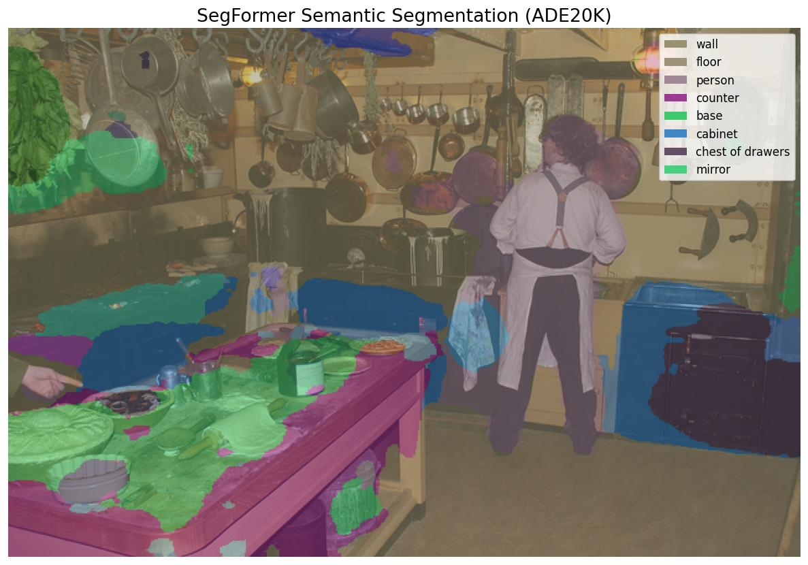

# SegFormer

**Paper**: [SegFormer: Simple and Efficient Design for Semantic Segmentation with Transformers](https://arxiv.org/abs/2105.15203)

SegFormer is a simple, efficient yet powerful semantic segmentation framework which unifies Transformers with lightweight multilayer perceptron (MLP) decoders. It comprises a hierarchically structured Transformer encoder which outputs multiscale features, and a lightweight All-MLP decoder which aggregates information from different layers.

## Model Variants

- **SegFormerB0** — Lightweight (embed_dim: 256, dropout_rate: 0.1)
- **SegFormerB1** — Small (embed_dim: 256, dropout_rate: 0.1)
- **SegFormerB2** — Medium (embed_dim: 768, dropout_rate: 0.1)
- **SegFormerB3** — Large (embed_dim: 768, dropout_rate: 0.1)
- **SegFormerB4** — Extra Large (embed_dim: 768, dropout_rate: 0.1)
- **SegFormerB5** — XXL (embed_dim: 768, dropout_rate: 0.1)

## Available Weights

| Variant | cityscapes_1024 | cityscapes_768 | ade20k_512 |
|---------|:-:|:-:|:-:|
| SegFormerB0 | ✅ | ✅ | ✅ |
| SegFormerB1 | ✅ | | ✅ |
| SegFormerB2 | ✅ | | ✅ |
| SegFormerB3 | ✅ | | ✅ |
| SegFormerB4 | ✅ | | ✅ |
| SegFormerB5 | ✅ | | ✅ |

## Basic Usage

```python
import kmodels

# Pre-Trained weights (cityscapes or ade20k or mit(in1k))
# ade20k and cityscapes can be used for fine-tuning by giving custom `num_classes`
# If `num_classes` is not specified by default for ade20k it will be 150 and for cityscapes it will be 19
model = kmodels.models.segformer.SegFormerB0(weights="ade20k", input_shape=(512,512,3))
model = kmodels.models.segformer.SegFormerB0(weights="cityscapes", input_shape=(512,512,3))

# Fine-Tune using `MiT` backbone (This will load `in1k` weights)
model = kmodels.models.segformer.SegFormerB0(weights="mit", input_shape=(512,512,3))
```

## Custom Backbone Support

```python
import kmodels

# With no backbone weights
backbone = kmodels.models.resnet.ResNet50(as_backbone=True, weights=None, include_top=False, input_shape=(224,224,3))
segformer = kmodels.models.segformer.SegFormerB0(weights=None, backbone=backbone, num_classes=10, input_shape=(224,224,3))

# With backbone weights
backbone = kmodels.models.resnet.ResNet50(as_backbone=True, weights="tv_in1k", include_top=False, input_shape=(224,224,3))
segformer = kmodels.models.segformer.SegFormerB0(weights=None, backbone=backbone, num_classes=10, input_shape=(224,224,3))
```

## Example Inference

```python
import kmodels
from kmodels.models.segformer import SegFormerImageProcessor, SegFormerPostProcessor

model = kmodels.models.segformer.SegFormerB0(weights="ade20k_512", input_shape=(512, 512, 3))

processed = SegFormerImageProcessor("image.jpg", size={"height": 512, "width": 512})

output = model(processed, training=False)

result = SegFormerPostProcessor(output)
print(f"Detected classes: {result['class_names']}")

# Output:
# Detected classes: ['building', 'sky', 'tree', 'road', 'sidewalk',
#   'person', 'car', 'streetlight']
```

### Data format

Every processor and format-sensitive post-processor in this module accepts a `data_format=None` kwarg. The default (`None`) resolves to `keras.config.image_data_format()`; pass `"channels_first"` or `"channels_last"` to override per-call without touching global state.

```python
# follow the global config (the default)
inputs = SegFormerImageProcessor("photo.jpg")

# force channels_first for this call only
inputs = SegFormerImageProcessor("photo.jpg", data_format="channels_first")
```

Image processors return tensors in the requested layout; post-processors accept tensors in either layout and read the flag to pick the channel axis. See `docs/utils.md` for which families have format-sensitive post-processors.

## Full Inference with Visualization

```python
import os
os.environ["KERAS_BACKEND"] = "torch"

import numpy as np
from PIL import Image
import matplotlib
matplotlib.use("Agg")
import matplotlib.pyplot as plt

from kmodels.models.segformer import SegFormerB0, SegFormerImageProcessor, SegFormerPostProcessor

model = SegFormerB0(weights="ade20k_512", input_shape=(512, 512, 3))

img = Image.open("image.jpg").convert("RGB")
original_size = img.size[::-1]  # (H, W)

processed = SegFormerImageProcessor(img, size={"height": 512, "width": 512})
output = model(processed, training=False)

result = SegFormerPostProcessor(output, target_size=original_size)
mask_resized = result["segmentation"]

# Generate colors per class
np.random.seed(42)
colors = np.random.randint(50, 220, size=(150, 3), dtype=np.uint8)

colored_mask = colors[mask_resized % 150]
overlay = np.array(img).copy()
alpha = 0.55
overlay = (overlay * (1 - alpha) + colored_mask * alpha).astype(np.uint8)

fig, ax = plt.subplots(1, 1, figsize=(10, 7))
ax.imshow(overlay)

# Legend for top classes by area
class_areas = [(c, (mask_resized == c).sum()) for c in result["unique_classes"]]
class_areas.sort(key=lambda x: -x[1])
top_classes = [c for c, _ in class_areas[:8]]
top_names = [n for c, n in zip(result["unique_classes"], result["class_names"]) if c in top_classes]

legend_patches = [plt.Rectangle((0, 0), 1, 1, fc=colors[c % 150] / 255.0) for c in top_classes]
ax.legend(legend_patches, top_names, loc="upper right", fontsize=10)

ax.set_title("SegFormer Semantic Segmentation (ADE20K)", fontsize=16)
ax.axis("off")
plt.tight_layout()
fig.savefig("segformer_output.jpg", bbox_inches="tight", dpi=120)
plt.close(fig)
```



## Custom Dataset Usage

When using a model fine-tuned on a custom dataset, pass your class names to the post-processor via `label_names`:

```python
from kmodels.models.segformer import SegFormerPostProcessor, CITYSCAPES_CLASSES

# For Cityscapes fine-tuned models
result = SegFormerPostProcessor(output, target_size=original_size,
    label_names=CITYSCAPES_CLASSES)

# For any custom dataset
MY_CLASSES = ["background", "road", "building", "vegetation"]
result = SegFormerPostProcessor(output, target_size=original_size,
    label_names=MY_CLASSES)
```

If `label_names` is not provided, ADE20K class names (150 classes) are used by default. Built-in class lists `ADE20K_CLASSES` and `CITYSCAPES_CLASSES` are available as imports.
