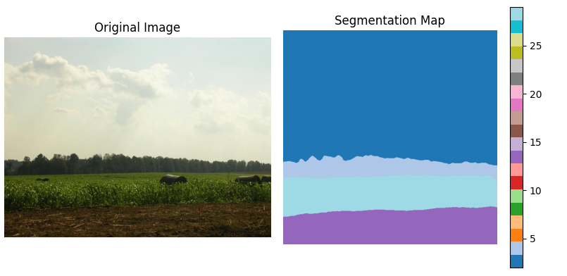

# Segmentation Models

## Basic Usage

```python
import kmodels

# Pre-Trained weights (cityscapes or ade20k or mit(in1k))
# ade20k and cityscapes can be used for fine-tuning by giving custom `num_classes`
# If `num_classes` is not specified by default for ade20k it will be 150 and for cityscapes it will be 19
model = kmodels.models.segformer.SegFormerB0(weights="ade20k", input_shape=(512,512,3))
model = kmodels.models.segformer.SegFormerB0(weights="cityscapes", input_shape=(512,512,3))

# Fine-Tune using `MiT` backbone (This will load `in1k` weights)
model = kmodels.models.segformer.SegFormerB0(weights="mit", input_shape=(512,512,3))
```

## Custom Backbone Support

```python
import kmodels

# With no backbone weights
backbone = kmodels.models.resnet.ResNet50(as_backbone=True, weights=None, include_top=False, input_shape=(224,224,3))
segformer = kmodels.models.segformer.SegFormerB0(weights=None, backbone=backbone, num_classes=10, input_shape=(224,224,3))

# With backbone weights
import kmodels
backbone = kmodels.models.resnet.ResNet50(as_backbone=True, weights="tv_in1k", include_top=False, input_shape=(224,224,3))
segformer = kmodels.models.segformer.SegFormerB0(weights=None, backbone=backbone, num_classes=10, input_shape=(224,224,3))
```

## Example Inference

```python
import kmodels
from PIL import Image
import numpy as np

model = kmodels.models.segformer.SegFormerB0(weights="ade20k_512")

image = Image.open("ADE_train_00000586.jpg")
processed_img = kmodels.models.segformer.SegFormerImageProcessor(image=image,
    do_resize=True,
    size={"height": 512, "width": 512},
    do_rescale=True,
    do_normalize=True)
outs = model.predict(processed_img)
outs = np.argmax(outs[0], axis=-1)
visualize_segmentation(outs, image)
```


## Available Segmentation Models

| Model Name | Reference Paper | Source of Weights |
|------------|----------------|-------------------|
| DeepLabV3 | [Rethinking Atrous Convolution for Semantic Image Segmentation](https://arxiv.org/abs/1706.05587) | `torchvision` |
| EoMT | [Encoder-only Mask Transformer for Panoptic Segmentation](https://arxiv.org/abs/2504.07957) | `transformers` |
| SegFormer | [SegFormer: Simple and Efficient Design for Semantic Segmentation with Transformers](https://arxiv.org/abs/2105.15203) | `transformers` |
